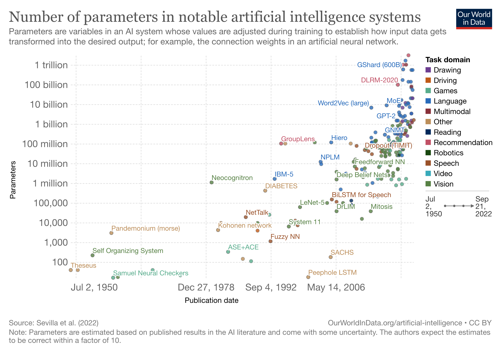

__Please do not write your name into this document.__

In the open-ended Exercises 2, 5, and 7, more extensive, carefully crafted, polished, insightful, and well motivated and explained answers will receive higher marks. Also see the assessment criteria on the course website https://lse-my472.github.io/


```{r load-packages, message=FALSE}

suppressMessages(library(tidyverse))
suppressMessages(library(readr))
suppressMessages(library(dbplyr))
suppressMessages(library(lubridate))
suppressMessages(library(ggthemes))
suppressMessages(library(colorspace))
suppressMessages(library(ggh4x))
suppressMessages(library(scales))
library(ggrepel)
library(httr)
suppressMessages(library(jsonlite))
suppressMessages(library(data.table))
library(DBI)
library(RSQLite)
library(XML)
suppressMessages(library(rvest))
suppressMessages(library(quanteda))
suppressMessages(library(quanteda.textplots))
suppressMessages(library(quanteda.textstats))
suppressMessages(library(syuzhet)) # for sentiment analysis (Exercise 6)
suppressMessages(library(devtools))
suppressMessages(library(hms))
suppressMessages(library(extrafont))
suppressMessages(library(extrafontdb))
suppressMessages(library(chron))
devtools::install_github("ricardo-bion/ggradar", 
                          dependencies = TRUE)
library(ggradar)
library(RColorBrewer)

```


### Exercise 1 (4 points)

Using the file `posts.csv` in the data folder of this repo (the sample of 10,000 public Facebook posts by members of the US congress from 2017), solve the following with `dplyr`:

- Do not consider posts with zero likes
- Compute the comment to like ratio (i.e.  comments_count / likes_count) for each post and store it in a column `clr`
- For each `screen_name`, compute a `normaliser_based_on_even_months = max(clr) - min(clr)`, i.e. the maximum minus the minimum `clr` value of posts by that `screen_name`, however, only taking into account __the posts made in even months, i.e. posts made in in February, April, June, August, October, December__ when computing `max(clr) - min(clr)` for each `screen_name`
- Set all `normaliser_based_on_even_months` that have a value of zero to NA or delete them
- Afterwards create a column `normalised_clr` which stores the `clr` of all posts from the original data frame (other than those with zero likes which were deleted in the first step) divided by the `normaliser_based_on_even_months` of the associated screen name. The only exception are posts from screen names that had a `normaliser_based_on_even_months` value of zero and were deleted/set to NA before -- for these posts just set the value in `normalised_clr` to NA as well or drop the post from the final data frame. In other words, the value of a single post/line $i$ (written by a politician $p$) in that `normalised_clr` column can be computed as: $normalised\_clr_{i,p} = clr_{i} \; / \; normaliser\_based\_on\_even\_months_{p}$ for all observations for which there is a non-NA `normaliser_based_on_even_months` (no need to use a loop for this though, `dplyr` allows to compute it in a vectorised way)
- Keep only those rows with `normalised_clr` > 0
- Arrange the data frame according to `normalised_clr` in ascending order
- Print out only `screen_name` and `normalised_clr` for the first 10 rows, i.e. the posts with the 10 lowest `normalised_clr`

```{r exercise-1, message = FALSE}
posts <- read_csv("data/posts.csv")

# Remove posts with 0 likes, create clr column.
posts <- posts %>%
  filter(likes_count > 0) %>%
  mutate(clr = comments_count/likes_count, month = as.numeric(format(date, "%m")))

# Isolate even months, group by screen_name, create normaliser, isolate data to be joined, make distinct.
even_posts <- posts %>% 
  filter(month %% 2 == 0) %>%
  group_by(screen_name) %>% 
  mutate(normaliser_based_on_even_months = max(clr) - min(clr)) %>%
  select(screen_name, normaliser_based_on_even_months) %>%
  distinct()

# Join normaliser to  posts data.
posts <- posts %>%
  left_join(even_posts, by = c("screen_name" = "screen_name")) 

# Set all `normaliser_based_on_even_months` that have a value of zero to NA or delete them
posts <- posts %>% 
  filter(normaliser_based_on_even_months > 0)

# create a column `normalised_clr` which stores the `clr` of all posts from the original data frame divided by the `normaliser_based_on_even_months` of the associated screen name. 
# Keep only those rows with `normalised_clr` > 0
posts <- posts %>% 
  mutate(normalised_clr = clr/normaliser_based_on_even_months) %>%
  filter(normalised_clr > 0)

# Arrange the data frame according to `normalised_clr` in ascending order
posts <- posts %>%
  arrange(normalised_clr)

# Print out only `screen_name` and `normalised_clr` for the first 10 rows, i.e. the posts with the 10 lowest `normalised_clr`
posts %>% 
  select(screen_name, normalised_clr) %>%
  head(10)

```

Hint: Any approach that yields the correct output here will receive full points, whether it uses multiple steps, merges, etc.


### Exercise 2 (15 points)

After the `dplyr` warm-up in the previous exercise, the next task will be to apply your knowledge of `dplyr` and other packages to an interesting real world-example with more extensive tabular data. Since 2021, there has been a much discussed rise in inflation in many economies. Often only a single number for inflation is computed and reported. It typically is the price change of an average basket of goods. "Basket" here just describes a set of goods with weights in which an average consumer approximately buys them. With the weights and prices of the individual goods, a price for the basket can be computed. The number for inflation is then the change of the basket's price over time.

There are many potential limitations of such an aggregate inflation figure. For example, businesses might be most interested in price changes only in their sectors. Furthermore, when prices of individual goods change in different ways, consumers will likely change the weights in which they buy goods. Hence, those aggregate inflation figures which keep the basket weights fixed for some time before reweighting, begin to deviate from the proportions in which people actually buy goods on average and become inaccurate. Also, while some goods see strong rises in prices, others do not. As a result, those consumers who buy goods in proportions far from the average consumer can face very different inflation figures. Taking all this into account, it can therefore be very interesting to analyse price changes of individual goods, smaller bundles of goods, etc. over time rather than only one aggregate number. Such findings can e.g. be helpful for researchers, businesses, consumers, or policy makers.

Since some years, the UK Office of National Statistics publishes detailed price data of goods which you can find [here](https://www.ons.gov.uk/economy/inflationandpriceindices/datasets/consumerpriceindicescpiandretailpricesindexrpiitemindicesandpricequotes). The website also contains extensive documentation. Download the csv file for "Price quotes, October 2022 edition of this dataset" (the correct file should be around 13MB), and the same for October 2021 and October 2020 (this e.g. allows to compute price changes from year to year, but you can also download additional/different months if helpful for your analysis). Explore the data, reshape and process it, and think of ways in which you can analyse and visualise it with packages such as `ggplot2` or `plotly`. You could e.g. look at prices of some goods vs. services, energy, how prices moved during different stages of the pandemic, etc. Thus, the answer can analyse prices changes for different goods and/or bundles of goods over time, report summary figures, and contain different visualisations. Also describe your analysis through written text via markdown. Did you find/learn anything interesting?

Note: As the downloaded data can quickly become too large for GitHub, you can store them outside your repository and load them from there along the lines of `read_csv(some/path/to/somefile.csv)`.

```{r ex-2-loading-and-wrangling,message = FALSE}
# October 2022 and a year before
oct_22 <- read_csv("/Users/christycoulson/Downloads/upload-pricequotes202210.csv")
oct_21 <- read_csv("/Users/christycoulson/Downloads/upload-pricequotes202110.csv")
# Most recent data and the year before
nov_22 <- read_csv("/Users/christycoulson/Downloads/upload-pricequotes202211.csv")
nov_21 <- read_csv("/Users/christycoulson/Downloads/upload-pricequotes202111.csv")
# 6 months ago
apr_22 <- read_csv("/Users/christycoulson/Downloads/upload-pricequotes202204.csv")
# 18 months ago
apr_21 <- read_csv("/Users/christycoulson/Downloads/upload-pricequotes202104.csv")
# 2 years ago
oct_20 <- read_csv("/Users/christycoulson/Downloads/upload-pricequotes202010.csv")
# 3 years ago
oct_19 <- read_csv("/Users/christycoulson/Downloads/upload-pricequotes201910.csv")
# month before lockdown and pandemic began
feb_20 <- read_csv("/Users/christycoulson/Downloads/upload-pricequotes202002.csv")
# month after lockdown and pandemic began
apr_20 <- read_csv("/Users/christycoulson/Downloads/upload-202004pricequotes.csv")

data <- rbind(nov_22,oct_22,apr_22,nov_21,oct_21,apr_21,oct_20,apr_20,feb_20, oct_19)

data <- data %>%
  mutate(QUOTE_DATE = ym(QUOTE_DATE)) %>%
  select(-VALIDITY, -SHOP_CODE, -BASE_VALIDITY, -STRATUM_CELL)

# Select 4 basic products 
# butter (211305), milk (211710), bread (210102), spaghetti/pasta (210204)

# Select 4 luxury products
# NECKLACE FASHION APX 16/20 INS (520140), HOTEL 1 NIGHT PRICE (640406), BOTTLE OF CHAMPAGNE 75 CL (310423), PERFUME/FRAGRANCE MEN OR WOMEN (520234)

bas_lux_data <- data %>%
  filter(ITEM_ID %in% c("211305","211710","210102","210204","520140","640406","310423","520234")) %>% 
  mutate(item_type = case_when(ITEM_ID %in% c("211305","211710","210102","210204") ~ "Basic",
                               ITEM_ID %in% c("520140","640406","310423","520234") ~ "Luxury")) 

# Summarise Data for Averages and standard errors
bas_lux_data_summarised <- bas_lux_data %>%
  group_by(ITEM_ID, ITEM_DESC, QUOTE_DATE, item_type) %>%
  summarise(avg_price = mean(PRICE),
            sd_price = sd(PRICE),
            sd_price_relative = sd(PRICE_RELATIVE), 
            avg_price_relative = mean(PRICE_RELATIVE),
            cinf_low = avg_price_relative - 1.96*sd_price_relative,
            cinf_high = avg_price_relative + 1.96*sd_price_relative) 
  
```

This analysis will seek to understand the relative impact of inflation on wealth inequality in the U.K. from October 2019 to November 2022. I will use 'basic' and 'luxury' item groupings in order to disentangle said impact. The logic here is that those who are poorer cannot afford to spend on luxury items as they spend a large portion of their income on basic, essential products whereas those who are more wealthy can, and will, spend money on luxury items. Thus, a higher increase in inflation for basic items compared to luxury items will disproportionally affect the disposable income, and thus quality of life, of poorer families compared to more wealthy ones. I have chosen to include 4 products in each basket, which are specified below:

__Basic:__

- Butter (211305)

- Milk (211710)

- Bread (210102)

- Spaghetti/Pasta (210204)

__Luxury:__

- Necklaces (520140)

- A 1-night stay in a hotel (640406)

- A 75cl bottle of champagne (310423)

- Perfume/Fragrance for men or women (520234)

These particular items were chosen due to the relatively large sample size, leading to less standard error in metrics. Also, the discourse around basics vs. luxury often mentions the aforementioned items to illustrate purchasing habits in the sense that champagne is often associated with the more wealthy, and items such as bread, butter, milk and dry pasta have been colloquially associated with the working class in Britain.

This analysis will also look at another interesting facet of wealth inequality in the U.K., regional inequality. This has been a prominent topic in the U.K. over the last couple of years, and there has been much talk around wealth inequality predicated on regional inequalities being deepened as a result of differing levels of access to investment and COVID relief funding during the last few years. I seek to better understand this context, and the intersectionality between relative basic/luxury inflation and regional inflation to challenge or affirm the notion that wealth inequality is deepening across multiple facets of British society.

In terms of sample selection for dates, I have used both an event-based and interval logic. The first COVID-19 lockdown came into effect in March of 2020, drastically changing economics in the U.K., and thus I have included October 2019 as our starting point, the last YoY date for our October 2022 data prior to COVID. I've also included February 2020, as this was the last month before the COVID-19 pandemic really 'hit' the U.K., and a month prior to the nation's first lockdown. I have chosen 6 monthly and 12 monthly intervals relative to our base October 2022 data. This has been done to standardise time distance and thus combat over/underfitting in some modelling contexts. I have also included November 2022 data as it is the most recent data available.

First, let's look at how the price of basic and luxury items have changed since prior to the first COVID-19 lockdown, from October 2019 until November 2022.

```{r ex-2-graph-1,message = FALSE}

bas_lux_data_summarised %>%
  group_by(item_type, QUOTE_DATE) %>%
  summarise(avg_item_type_price = mean(avg_price)) %>%
  ggplot(aes(x = QUOTE_DATE, y = avg_item_type_price, colour = item_type)) +
  geom_smooth() +
  geom_jitter() +
  guides(color = guide_legend(title = "Item Type")) +
  ggh4x::facet_grid2(~item_type, scales = "free_y", independent = "y") +
  theme_economist() +
  labs(title = "Average Price of Basic and Luxury Goods from October 2019 until November 2022",
       subtitle = "Basic Products have, on average, experienced price inflation to a much greater extent than luxury products") +
  xlab("Date") +
  ylab("Average Price per Item Type") +
  theme(legend.position = "bottom", 
        plot.title = element_text(size = 11, hjust = 0), 
        plot.subtitle = element_text(size = 9, hjust = 0),
        strip.text.x = element_blank())

```

__Basic vs. Luxury__

First, let's begin with a broad analysis of price inflation for both Basic and Luxury product groups. Despite being only a few data points, the data contributing to these descriptive statistics is summarised from 7444 observations of pricing for basic items and 7629 for luxury items. I chose to use the price variable here and aggregate up instead of the price relative variable because the price variable relative, according to the documentation, measures relative to the January price of that year. Thus, months later in the year are likely to have higher values due to the cumulative nature of inflation. The Line above uses soothed conditional means, and the confidence intervals are based on standard error. 

As seen above, the average price of basic items has seen a consistent positive trend since October 2020. In contrast, luxury items have experienced s fairly neutral overall price change from October 2019 to November 2022 which has been characterised by both rises and falls in overall price. The outcome of this inflationary pressure is that, assuming that both a working class and wealthier family consume basic products at the same rate, the inflationary pressure from basic products disproportionality affects the poorer familys disposable income as the proportion of their wealth allocated to said product increases at a greater rate. In contrast, richer families, who are less affected by rises in basic product prices (in terms of the proportion of their overall wealth) can still purchase luxury products at similar prices as before. Thus, in Britain, poorer families will have less disposable income in terms of the proportion of their overall wealth in ratio to rich families as a result of consistent high inflation for basic goods.

Another thing to note about the above graphic is that both basic and luxury products experienced price decreases at the beginning of COVID-19. This continued until the discontinuing of the 'Eat Out to Help Out' scheme, which offered discounts on meals in the U.K., finished. This was followed by an uptick in inflation at around September/October 2020, where the infamous 'rule of six' rule was put in place and, interestingly, a second lockdown was enforced. It seems then, that the relationship between enforcing strict COVID-19 restrictions and price inflation is non-linear for both. We should look at the distributions of observed prices relative to January for their respective year to see how distribution shapes are different.

```{r ex-2-graph-2, message=FALSE, warning=FALSE}

bas_lux_data %>%
  ggplot(aes(fill = item_type)) +
  geom_density(aes(x = PRICE_RELATIVE), alpha = 0.5) +
  guides(fill = guide_legend(title = "Item Type")) +
  xlim(0,2.1) +
  labs(title = "Price Change Relative to January of Respective Year for Basic and Luxury Goods Since October 2019", 
       subtitle = "Basic goods have increased in value to a greater proportion than luxury goods") +
  xlab("Price Change Relative to January of Respective Year") +
  ylab("Density") +
  theme_economist() +
  theme(axis.text.y = element_blank(),
        axis.ticks.y = element_blank(),
        legend.position = "bottom", 
        plot.title = element_text(size = 10, hjust = 0), 
        plot.subtitle = element_text(size = 8, hjust = 0))

```

Despite the relative price change being compared to January of the given year, and the quote year being different for differing observations (thus values being measured relative to different values per year), they occur in comparable year/month combinations and thus we can compare densities, as if they were the same we would expect symmetry. For basic goods in total, the average relative price (inflation vs. January) is 0.999, meaning that prices, on average, stayed the same. This is lower than expected due to price drops prior to 2021. For luxury goods, the average relative price is 0.864. This indicates that, on average, basic goods rose in price more than luxury goods. Let's look at prices since the beginning of 2021 to see if the pattern is different.


```{r ex-2-graph-3, message=FALSE, warning=FALSE}
bas_lux_data_summarised %>%
  filter(year(QUOTE_DATE) > 2020) %>%
  group_by(item_type) %>%
  summarise(avg_price_relative = mean(avg_price_relative))
# Basic = 1.055, Luxury = 0.891

bas_lux_data %>%
  filter(year(QUOTE_DATE) > 2020) %>%
  ggplot(aes(fill = item_type)) +
  geom_density(aes(x = PRICE_RELATIVE), alpha = 0.5) +
  guides(fill = guide_legend(title = "Item Type")) +
  xlim(0, 2.5) +
  labs(title = "Price Change Relative to January of Respective Year for Basic and Luxury Goods Since January 2021", 
       subtitle = "Basic goods have increased in value to a greater proportion than luxury goods") +
  xlab("Price Change Relative to January of Respective Year") +
  ylab("Density") +
  theme_economist() +
  theme(axis.text.y = element_blank(),
        axis.ticks.y = element_blank(),
        legend.position = "bottom", 
        plot.title = element_text(size = 10, hjust = 0), 
        plot.subtitle = element_text(size = 9, hjust = 0))


```

There are two main insights we can derive from the above graphic. The first concerns the differing skews for basic and luxury goods.Luxury goods have an average relative price decrease of around 10.9%. In contrast, Basic goods rose in price by 5.5%, a difference of 16.4% (rounded). This results in a negative skew for luxury products (price decrease), and a positive skew for positive products (price increase). This difference can be viewed graphically above, as a greater density of basic average relative price sits between 1.0 and 1.5 (price stability to 50% price increase), whereas the density is greater for luxury products between 0.5 and 1.0 (50% price decrease to price stability). Interestingly, there is a large spike for luxury products around 100-90% average relative price decrease, relative to basic goods.

So, we can infer from the above graph that inflationary pressure since 2021 has likely affected poorer families disposable income and quality of life to a greater proportional extent that more wealthy families. However, there may be additional explanatory variables, such as region, which help explain the puzzle of wealth inequality distribution in Britain. Let's explore this below.

In order to better understand regional inequality, I want to select one region that is regarded as wealthy, and one which is regarded as less wealthy. According to the Equality Trust, the South East and London are the wealthiest regions, and the North East and North West are the least wealthy. This analysis can be found here: https://equalitytrust.org.uk/scale-economic-inequality-uk#:~:text=Wealth%20is%20also%20unevenly%20spread,North%20West%20(%C2%A3165%2C200).&text=The%20UK's%20wealth%20distribution%20is,to%20the%20other%20OECD%20countries. Thus, I will isolate those four regions, combine South East and London into 'South East' and combine North West and North (there is no North East region in the data) into 'North' These are crude definitions, but facilitate this analysis. Then, I will make a comparison on price inflation for these two differing regions to test the hypothesis that regional inequality exacerbates existing inequalities between rich and poor, which are evidenced in the two graphs above.

```{r ex-2-graph-4, message = FALSE}
# Create dataset with just North and South East, create variable determining Region
data_N_SE <- data %>%
  filter(REGION %in% c(2,3,9,10) & ITEM_ID %in% c("211305","211710","210102","210204","520140","640406","310423","520234")) %>%
  mutate(Region_2 = case_when(REGION %in% c(2,3) ~ "South East", 
                              REGION %in% c(9,10) ~ "North"),
         item_type = case_when(ITEM_ID %in% c("211305","211710","210102","210204") ~ "Basic",
                               ITEM_ID %in% c("520140","640406","310423","520234") ~ "Luxury")) 

# Summarise dataset to create variables of interests.
N_SE_summarised <- data_N_SE %>%
  group_by(ITEM_ID, ITEM_DESC, QUOTE_DATE, Region_2, item_type) %>%
  summarise(avg_price = mean(PRICE),
            sd_price = sd(PRICE),
            sd_price_relative = sd(PRICE_RELATIVE), 
            avg_price_relative = mean(PRICE_RELATIVE),
            cinf_low = avg_price_relative - 1.96*sd_price_relative,
            cinf_high = avg_price_relative + 1.96*sd_price_relative)

```


```{r ex-2-graph-5, message = FALSE}

N_SE_summarised %>%
  filter(year(QUOTE_DATE) > 2020) %>%
  group_by(item_type, Region_2, QUOTE_DATE) %>%
  summarise(avg_item_type_price_relative = mean(avg_price_relative)) %>%
  ggplot(aes(x = QUOTE_DATE, y = avg_item_type_price_relative, colour = item_type)) +
  geom_smooth(se = FALSE) +
  geom_jitter() +
  guides(color = guide_legend(title = "Item Type")) +
  ggh4x::facet_grid2(~Region_2) +
  theme_economist() +
  labs(title = "Average Relative Price Change for 2021 & 2022 for North and South East Regions",
       subtitle = "The north has consistently experienced a greater disparity in price inflation between basic and luxury goods") +
  xlab("Date") +
  ylab("Relative Price Change") +
  theme(legend.position = "bottom", 
        plot.title = element_text(size = 11, hjust = 0), 
        plot.subtitle = element_text(size = 9, hjust = 0),
        plot.caption.position = "plot")


```

__Regional Inflation and Wealth Inequality__

The Line above uses soothed conditional means. In the North of the country, the prices for basic goods have never reduced relative to January by more than 2%. In contrast, the South East experienced price deflation for basic goods until Mid-2022, with a peak in deflation at -7.5%. In addition, the gap in inflationary pressure between basic and luxury good consistently exceeded 10%. With a peak difference of around 38% (basic goods inflating 38% more than luxury goods, relative to the January of 2022), inflationary differences were greater between basic and luxury goods for the North than the South East. This pressure likely exacerbates the pre-existing regional wealth inequality between those in the North of the country, and those in the South East. It seems, then, that inflationary pressure has disproportionately affected poorer households when intersecting regional inequality with basic/luxury proportional spending habits of the wealthy vs. less-so wealthy. Let's look at densities to understand whether this is reflected in the distributions of relative price changes.

```{r ex-2-graph-6, message=FALSE, warning=FALSE}

data_N_SE %>%
  filter(year(QUOTE_DATE) > 2020) %>%
  ggplot(aes(fill = item_type)) +
  geom_density(aes(x = PRICE_RELATIVE), alpha = 0.5) +
  guides(fill = guide_legend(title = "Item Type")) +
  ggh4x::facet_grid2(~Region_2) +
  xlim(0, 2.5) +
  labs(title = "Price Change Relative to January of Respective Year for Basic and Luxury Goods Since January 2021", 
       subtitle = "Basic goods have increased in value to a greater proportion than luxury goods") +
  xlab("Price Change Relative to January of Respective Year") +
  ylab("Density") +
  theme_economist() +
  theme(axis.text.y = element_blank(),
        axis.ticks.y = element_blank(),
        legend.position = "bottom", 
        plot.title = element_text(size = 10, hjust = 0), 
        plot.subtitle = element_text(size = 9, hjust = 0))

```

Somewhat surprisingly, the density patterns seem to be similar for the North and South East. The North has a slightly greater positive inflation skew for basic goods, whereas the South East has a fatter positive tail for Luxury goods. This difference likely represents the relative wealth of the two regions. However, overall, it seems that both the North and South East are distributed the same, likely as a result of being subject to the same macro-economic patterns that Britain has experienced over the last couple of years - namely Brexit, the Russian invasion of Ukraine, COVID-19, and lack of coherent domestic economic policy in Britain. To conclude, we already know that wealth inequality exists, and has existed in the U.K. for centuries. This is evidenced here: https://equalitytrust.org.uk/scale-economic-inequality-uk. Trends in research into wealth inequality in the last few decades have focused on intersectionality with gender, class, ethnicity and region. This research is evidenced in papers such as Warren's 2008 analysis, found here: https://doi.org/10.1080/13545700500508502. The purpose of my analysis was to try to better understand whether inflation has worsened wealth inequality in the past few years. Inflation has affected basic, essential goods to a greater extent than it has luxury goods. As poorer households already spend a greater portion of their income on these basic goods, this difference in inflation means that inflation affects their disposable income, and thus quality of life, to a greater extent than wealthier households. This is especially true from 2021 onwards, where COVID-19 began to be placated by vaccine roll-outs and other worries began to affect prices in Britain, namely economic policy, energy crises, Brexit, and the war in Ukraine. This intersects with regional inequality. Poorer households in the North experienced greater relative inflation between basic and luxury goods than those in the wealthier South East. This deepens the inequality divide. This divide is again exacerbated by differences in government investment between the North and South East, which have been consistently reported on during and after COVID. An example of such reporting is here: https://www.theguardian.com/society/2022/jan/16/englands-north-south-divide-is-deepening-says-new-report. I anticipate such a growth in the gap between rich and poor will likely have broad social, political and cultural implications as we move through the 2020s. This would be an interesting avenue for further study.


### Exercise 3 (10 points)

Use `ggplot2` to try to replicate the following [plot](https://ourworldindata.org/grapher/artificial-intelligence-parameter-count) on parameter numbers in AI systems from Our World in Data. Start with the basic features of the plot and then try to get as close to the original as possible with `ggplot2`. __There is no need to animate the plot, just use the latest static plot and replicate that.__ As the data might change over time, feel free to download the image version from the website that you are going to replicate. Then you can add this image into the repo and afterwards bind it into this markdown e.g. with `` as a reference below your own plot.

Note: When you click on `DOWNLOAD` below the plot on the [website](https://ourworldindata.org/grapher/artificial-intelligence-parameter-count), you can download the latest image as well as all data.


```{r ex-3-load,message=FALSE}
ai_data <- read_csv("data/artificial-intelligence-parameter-count.csv")

```

```{r ex-3-graph,message=FALSE, warning=FALSE}
# Y axis break values
y_axis_breaks <- c(100,1000,10000,100000,1000000,10000000,100000000,1000000000,10000000000,100000000000,1000000000000)

# Final graph
ai_data %>%
  filter(!Domain %in% c("VIsion","Text-to-Video")) %>%
  ggplot(aes(x = Day, y = Parameters)) +
  geom_point(aes(fill = Domain), pch = 21) +
  geom_text_repel(aes(fill = Domain,
                      colour = Domain,
                      label = ifelse( Entity == "NPLM" | Entity == "Hiero" | Entity == "IBM-5" | Entity == "NetTalk" | Entity == "BiLSTM for Speech" | Entity == "Theseus" |  Entity == "Neocognitron" | Entity == "DIABETES" | Entity == "System 11" | Entity == "Self Organizing System" | Entity == "Pandemonium (morse)" | Entity == "Samuel Neural Checkers" | Entity == "ASE+ACE" | Entity == "Kohonen network" | Entity == "Fuzzy NN" | Entity == "SACHS" | Entity == "Peephole LSTM" | Entity == "LeNet-5" | Entity == "GroupLens" | Entity == "DEM" | Entity == "Deep Belief Nets" | Entity == "Feedforward NN"| Entity == "Dropout(TIMIT)" | Entity == "Word2Vec (large)" | Entity == "GPT-2" | Entity == "MoE" | Entity == "DLRM-2020" | Entity == "GShard(600B)" | Entity == "GNMT" | Entity == "Mitosis", Entity, "")),
            check_overlap = TRUE,
            max.overlaps = 14,
            max.time = 3,
            direction = "y",
            inherit.aes = TRUE,
            position = position_dodge(),
            show.legend = FALSE,
            size = 2.5) +
  guides(fill = guide_legend(title = "Task Domain", 
                             override.aes = list(size = 2, shape = 22),
                               title.theme = element_text(face = "bold", size = 9))) +
  scale_y_log10(labels = scales::label_number_si(), breaks = y_axis_breaks) +
  scale_x_date(date_labels = "%b %d, %Y", breaks = as.Date(c("1950-07-02","1978-12-27", "1992-09-04", "2006-05-14"))) +
  scale_fill_manual(values = c("Drawing" = "darkorchid4","Driving" = "chocolate3","Games" = "seagreen3","Language" = "royalblue3","Multimodal" =  "firebrick4","Other" = "burlywood3","Reading" = "blue4","Recommendation" = "hotpink3","Robotics" = "darkgreen","Speech" = "sienna4","Video" = "turquoise2","Vision" = "seagreen4")) +
    scale_colour_manual(values = c("Drawing" = "darkorchid4","Driving" = "chocolate3","Games" = "seagreen3","Language" = "royalblue3","Multimodal" =  "firebrick4","Other" = "burlywood3","Reading" = "blue4","Recommendation" = "hotpink3","Robotics" = "darkgreen","Speech" = "sienna4","Video" = "turquoise2","Vision" = "seagreen4")) +
  labs(title = "Number of parameters in notable artificial intelligence systems",
       subtitle = "Parameters are variables in an AI system whose values are adjusted during training to establish how input data gets\n transformed into the desired output; for example, the connection weights in an artificial neural network.", 
       caption  = "Source: Sevilla et al. (2022)                                                    OurWorldinData.org/artificial-intelligence CC BY
Note: Parameters are estimated based on published results in the Al literature and come with some uncertaintv. The authors expect the estimate\nto be correct within a factor of 10.") +
  xlab("Publication date") +
  ylab("Parameters") +
  theme_minimal() +
  theme(plot.title = element_text(size = 15, colour = "grey30", family = "serif"),
        plot.subtitle = element_text(size = 9, colour = "grey30", family = "serif"),
        axis.text = element_text(size = 8),
        axis.title.x = element_text(size = 8),
        axis.title.y = element_text(size = 8),
        legend.text = element_text(size = 9),
        legend.justification = "top",
        legend.box.margin = margin(0,0.5,0.5,0.5),
        legend.spacing.y = unit(0.01, "cm"),
        legend.spacing.x = unit(0, "cm"),
        plot.caption = element_text(colour = "grey50", size = 7.5,hjust = 0),
        plot.tag.position = c(.9,.3), 
        plot.tag = element_text(size = 10),
        panel.grid.major = element_line(linetype = "dashed"))

```




### Exercise 4 (7 points)

When analysing textual data, the approaches we discussed such as counting tokens and building dictionaries, are already sufficient to answer many research questions. When the goal is to obtain an overview of information contained in unstructured textual data, however, some additional approaches such as ["named-entity linking"](https://en.wikipedia.org/wiki/Entity_linking) can be very helpful to know. Using a language model and a knowledge base, these tools can find words which describe people, institutions, places, etc., and importantly also obtain their ID in databases such as [Wikidata](https://www.wikidata.org/wiki/Wikidata:Main_Page). This allows to automatically extract an approximate list of e.g. institution who have a Wikidata entry and are mentioned in the text, which is very convenient for obtaining additional information via Wikidata/Wikipedia afterwards.

An open-source option is `OpenTapioca` which you can try in your browser via this [link](https://opentapioca.org/). It is e.g. implemented in Python as a plugin to the library [`spaCy`](https://spacy.io/api). The task of this exercise is to build an own simple function from scratch in R that allows to use OpenTapioca. A good first step is usually to check out the source code of the original (here Python) function which you can find

[here](https://github.com/UB-Mannheim/spacyopentapioca/blob/main/spacyopentapioca/entity_linker.py). There is no need to know Python for this exercise, just looking at "url" and the function "make_request" in the code already indicates that it is actually just querying an API. Thus, using `httr` it is possible to build a simple function also in R. I have started this function, your task is to complete it and then demonstrate that it works with the exemplary sentences added below.

The function should return a tibble as output named `top_wikidata_links` with one row being one entity that was found in the input text and four columns being "id" (the Wikidata id), "label" (the name), "description" (a short description returned by the API via "$desc" -- note that for some entities this description can be null, in that case just set the description in the output tibble to NA), and "score" (higher generally indicates a better fit to the text). You can also add further columns to your returned tibble, but the first four need to be these. The tibble should have as many rows as entities that were found in the text and had a score larger than `minimum_score`, which is a cutoff that the user can choose (all other matches returned by the API call with lower scores should not be included in the tibble).

Note that this open-source API does not work perfectly and misses some entities in texts, but can already be very helpful when exploring textual data. With very long input texts, it could also be tried whether breaking them down into smaller parts (e.g. sentences or paragraphs) before inputting them into the API increases accuracy or not.

Hint: Note that in the first test below, the two detected entities will be "Karl Popper" and "LSE". "Karl Popper" only returns a single match, however the "LSE" part of the text will return also matches other than the London School of Economics and Political Science, e.g. the London Stock Exchange. For each entity that the API returns, the tibble returned by the function needs to include a row as long as its associated score is larger than the minimum score.


```{r ex-4-function,message = FALSE}
get_wikidata_links <- function(input_text, minimum_score) {
  
  #
  # Function which takes a character vector of length 1 as input (i.e. all text
  # needs to be combined into a single character) as well as a minimum certainty
  # score, and returns a tibble with key information and links to Wikidata
  #
  # Input
  #  - input_text: Text input (character)
  #  - minimum_score: Minimum score that every returned entity needs to have
  #                   (numeric)
  #
  # Output
  #  - top_wikidata_links: Table with the first four columns being 'id', 'label',
  #               'description', 'score' (tibble)
  #
  
  top_wikidata_links <- data.frame(id = character(),
  label = character(),
  desc = character(),
  score = numeric())

  base_url <- "https://opentapioca.org/api/annotate" 

  Text <- GET(base_url, query = list(query = input_text)) %>%
    content("text") %>% 
    fromJSON(flatten = FALSE)

  Data <- Text$annotations$tags
   
  for (i in 1:length(Data)) {
      
    d_row <- Data[[i]] %>%
      select(id, label, desc, score)
    
    top_wikidata_links <- rbind(top_wikidata_links, d_row)
    
    top_wikidata_links <- as_tibble(top_wikidata_links) %>%
      filter(score > minimum_score)
  
  }
  
  return(top_wikidata_links)
}

```

Next demonstrate that your function works by running the following two tests:

```{r ex-4-test,message = FALSE}
# Test 1
text_example_1 <- "Karl Popper worked at the LSE."
get_wikidata_links(text_example_1, -0.5)

# 
# Hint: The output should be a tibble similar to the one outlined below
#
# | id | label | description | score |
# | "Q81244" | "Karl Popper" | "Austrian-British philosopher of science" | 2.4568285 |
# | "Q174570" | "London School of Economics and Political Science" | "university in Westminster, UK" | "1.4685043" |
# | "Q171240" | "London Stock Exchange" | "stock exchange in the City of London" | "-0.4124461" |
Sys.sleep(20)

# Test 2
text_example_2 <- "Claude Shannon studied at the University of Michigan and at MIT."
get_wikidata_links(text_example_2, 0)
```

### Exercise 5 (25 points)

The New York Times (NYT) APIs offer a rare free opportunity to analyse news data since 1851 (the year of the first issue of the paper). The "Archive API" allows to download all article headlines and lead paragraphs/snippets for a given month (and through iteration potentially for a range of years). While this does not allow to obtain the full articles, it still allows to download a substantial amount of textual data and thereby do own text analysis.

The task of this exercise is to use the __Archive API__ (not the Article Search API) to develop and present a coherent analysis of a topic of your choice. This could e.g. be the news coverage of a specific historical event somewhere in the last 130 years that you are interested in (in that case the downloaded archive data would be the month(s) of that event) or also a general topic over time. While the NYT Archive API is the primary source of the analysis, in a next step also use either Wikidata (e.g. accessible via these [options](https://www.wikidata.org/wiki/Wikidata:Data_access) such as an API or the Wikidata websites themselves), or alternatively scrape Wikipedia to obtain further information on topics relevant for the selected newspaper texts. You can get links between NYT texts and Wikipedia e.g. via the function developed on Exercise 4 (or some variation of that function) and/or just manually by reading the articles and deciding which information to look up on Wikidata/Wikipedia. Your answer can e.g. contain text analysis with `quanteda`, word clouds, visualisations with `ggplot2` or `plotly `, analysis of tabular data with `dplyr`, or use of further R packages. Also motivate and describe your analysis through markdown texts.

As the downloaded data can again quickly become too large for GitHub, you can store them outside your repository and load them from there.

Hint 1: You might find the code examples from week 5 helpful for this exercise. For the Archive API, the last section in the file `02-nytimes-api.Rmd` illustrates how you can transform its output into a data frame. Usually the main available text is contained in the headline, abstract, lead_paragraph, and/or snippet columns (depending on which month/year you download some of these can be empty or the same). Note that the headline information in the data frame is nested and can be accessed with `df$headline$main`.

Hint 2: Named entity linking with tools such as OpenTapioca gives identifiers for Wikidata such as e.g. "Q7099". Not every Wikidata page also has an associated Wikipedia page, but those that have do contain links to the Wikipedia page. You can e.g. see this on Emmy Noether's Wikidata page https://www.wikidata.org/wiki/Q7099 which contains links to her Wikipedia page in many languages in case you prefer to scrape data from Wikipedia rather than using Wikidata.

```{r ex-5-load-wrangle, message = FALSE}
# Studying the news reported from the NYT on the Rwandan Genocide
# Genocide went from April 7 until 15 July 1994. 
# 20 year anniversary was April 2014. 

apikey <- "1AQ9XbHC4ukGUg9OfJpFgNGok4tAUix3"

# Genocide period April - July 2014.
rg_nyt_apr <- GET("https://api.nytimes.com/svc/archive/v1/1994/4.json?api-key=1AQ9XbHC4ukGUg9OfJpFgNGok4tAUix3")
rg_nyt_may <- GET("https://api.nytimes.com/svc/archive/v1/1994/5.json?api-key=1AQ9XbHC4ukGUg9OfJpFgNGok4tAUix3")
rg_nyt_jun <- GET("https://api.nytimes.com/svc/archive/v1/1994/6.json?api-key=1AQ9XbHC4ukGUg9OfJpFgNGok4tAUix3")
rg_nyt_jul <- GET("https://api.nytimes.com/svc/archive/v1/1994/7.json?api-key=1AQ9XbHC4ukGUg9OfJpFgNGok4tAUix3")
# 20 year anniversary
rg_nyt_20_years <- GET("https://api.nytimes.com/svc/archive/v1/2014/4.json?api-key=1AQ9XbHC4ukGUg9OfJpFgNGok4tAUix3")

# April 1994
rg_nyt_apr_json_as_text <- content(rg_nyt_apr, "text")
json_apr_1994 <- fromJSON(rg_nyt_apr_json_as_text)
df_apr_1994 <- json_apr_1994$response$docs %>% as_tibble() %>%
  mutate(headline_txt = headline$main) %>%
    select("abstract", "lead_paragraph", "headline_txt", "pub_date", "_id") 

# May 1994
rg_nyt_may_json_as_text <- content(rg_nyt_may, "text")
json_may_1994 <- fromJSON(rg_nyt_may_json_as_text)
df_may_1994 <- json_may_1994$response$docs %>% as_tibble() %>%
  mutate(headline_txt = headline$main) %>%
    select("abstract", "lead_paragraph", "headline_txt", "pub_date", "_id") 

# June 1994
rg_nyt_jun_json_as_text <- content(rg_nyt_jun, "text")
json_jun_1994 <- fromJSON(rg_nyt_jun_json_as_text)
df_jun_1994 <- json_jun_1994$response$docs %>% as_tibble() %>%
  mutate(headline_txt = headline$main) %>%
    select("abstract", "lead_paragraph", "headline_txt", "pub_date", "_id") 

# July 1994
rg_nyt_jul_json_as_text <- content(rg_nyt_jul, "text")
json_jul_1994 <- fromJSON(rg_nyt_jul_json_as_text)
df_jul_1994 <- json_jul_1994$response$docs %>% as_tibble() %>%
  mutate(headline_txt = headline$main) %>%
    select("abstract", "lead_paragraph", "headline_txt", "pub_date", "_id") 

# 20 Year Anniversary
rg_nyt_201404_json_as_text <- content(rg_nyt_20_years, "text")
json_jul_201404 <- fromJSON(rg_nyt_201404_json_as_text)
df_201404 <- json_jul_201404$response$docs %>% as_tibble() %>%
  mutate(headline_txt = headline$main) %>%
    select("abstract", "lead_paragraph", "headline_txt", "pub_date", "_id") 

rg_nyt <- rbind(df_apr_1994, df_may_1994, df_jun_1994, df_jul_1994, df_201404)

# Make pub_date date/time data type
rg_nyt <- rg_nyt %>%
  mutate(pub_date = as.Date(substr(pub_date, 1, 10), "%Y-%m-%d")) %>%
  filter(grepl("Rwanda", abstract))
# Now Wikipedia

rwandan_genocide_url <- "https://en.wikipedia.org/wiki/Rwandan_genocide"
rwandan_genocide_html <- read_html(rwandan_genocide_url)
rwandan_genocide_text_content <- rwandan_genocide_html %>% html_elements(css = "p") %>% html_text() %>% paste(collapse = " ")

rwandan_genocide_tables <- html_table(rwandan_genocide_html, fill = TRUE)

```

```{r ex-5-qtext-wrangle, message = FALSE}
# split during genocide from after genocide
rg_nyt_1994 <- rg_nyt %>%
  filter(year(pub_date) < 2000) 

rg_nyt_2014 <- rg_nyt %>%
  filter(year(pub_date) > 2000) 

# corpus of abstract from 1994
rg_nyt_abs_corpus_1994 <- corpus(rg_nyt_1994$abstract)

# corpus of abstract from 2014
rg_nyt_abs_corpus_2014 <- corpus(rg_nyt_2014$abstract)

# dfm 1995
rg_nyt_abs_1994_dfm <- tokens(rg_nyt_abs_corpus_1994, remove_punct = TRUE) %>% 
  tokens_remove(stopwords("en")) %>% 
  tokens_wordstem() %>%  
  dfm() %>% 
  dfm_trim(min_termfreq = 2)

# dfm 2014
rg_nyt_abs_2014_dfm <- tokens(rg_nyt_abs_corpus_2014, remove_punct = TRUE) %>% 
  tokens_remove(stopwords("en")) %>% 
  tokens_wordstem() %>%  
  dfm() %>% 
  dfm_trim(min_termfreq = 2)

```


__Exercise 5: Using the NYT Archive API to Examine the Rwandan Genocide.__

This analysis will centre around the reporting on the 1994 Rwandan Genocide, which took place between 7 April 1994 and 15 July 1994 in the midst of the the Rwandan Civil War. The violence erupted after the assassination of Rwandan president, Juvénal Habyarimana. I have extracted data from April to July of 1994, which covers the genocide period, and reporting from April 2014, which marked the 20th year anniversary of the conflict. During this period, members of the Tutsi ethnic minority group, as well as some moderate Hutus and Twa, were killed by armed Hutu (ethnic majority) militias and their associates. It is estimated that between 500,000 and 662,000 Tutsis died during this period of around 100 days. In addition, an estimated 250,000 to 500,000 women were said to experience sexual violence during this time. I will allow an extract from Wikipedia to add some colour to the events leading to the beginning of the Rwandan Genocide. This can be found below:

```{r ex-5-quote-1,message = FALSE}
html_elements(rwandan_genocide_html, css = "#mw-content-text > div:nth-child(1) > p:nth-child(12)") %>%
  html_text()  %>%
  str_replace_all("\n", "") %>%
  str_replace_all("\\[4]", "")
```

The genocide was characterised by its brutality. Many victims were killed in their own locale, and both neighbours and family members  collaborated with militias in the identification and murder of thousands of Tutsi, as well as some moderate Hutu and Twa. Despite this, there were no interventions by foreign powers until the UN's non-armed presence. Due to this brutality, it is wise to begin with a frequency analysis of the types of words used in the NYT during the period to cover the event to see if the coverage captured such a characteristic.

```{r ex-5-graph-1, message = FALSE}
# most frequent words 1994
names(topfeatures(rg_nyt_abs_1994_dfm, 100))

# wordcloud 1994
textplot_wordcloud(rg_nyt_abs_1994_dfm, rotation=0.1, random_order = FALSE, min_size= 0.5, max_size=8, min_count = 10, max_words=200, color = "red")

```

Interestingly, nationalistic tropes such as 'nation,' 'unite,' 'rwandan,' are the most frequently words used, despite being a war within a single country rather than between two nation states. This likely alludes to the internal Rwandan discourse during the genocide, whereby the genocide occurred off the back of a lengthy civil war in which the dominant mobilising Hutu discourse of the conflict concerned the characterisation of the Tutsi minority as a foreign, homogeneous threat to Hutu interests. It's interesting that this is captured by a western media outlet such as the NYT. 

The second tier of word frequencies seems to revolve around a common theme, acts of political violence. Words such as 'kill,' 'death,' 'war,' 'rebel,' 'and 'massacre' are common throughout. The reported brutality captured the western world in 1994, and this descriptive language likely contributed to the worldwide awareness. 

Despite this awareness, however, the international community has been criticised for its lack of response to the genocide. The third tier of word frequency contains themes of foreign powers, colonialism, intervention and aid. The word 'French' is particularly interesting because from 1819 Rwanda was a German colony, and was administered by Belgium from 1919 via indirect rule. This is likely so frequent as the French government actively supported the Hutu-led government of Habyarimana, prior to his assassination. In addition, the French launched _Amaryllis_ (Operation Turquoise) to evacuate French and Belgian expatriates whilst refusing to take any Tutsi Rwandans with them. This was the source of significant controversy at the time. Words such as 'report,' 'relief,' 'food,' 'Clinton,' and 'govern' refer directly to the strange paradox that, despite wordwide attention, foreign intervention did not occur until the Belgian-led White Helmet (United Nations) presence towards the end of the fighting. The Rwandan genocide is extemely important in the context of international relations as it was said to be the catalyst for the Responsibility to Protect (R2P) United Nations doctrine that opened the way for future foreign interventions in the 21st century. We will explore this in greater detail towards the end of this analysis. First, however, let's perform a quantitative sentiment analysis to better understanding the general sentiment themes produced in the NYT concerning the Rwandan genocide during its occurrence.

```{r ex-5-graph-2, message=FALSE, warning=FALSE}

# isolate headlines
headlines <- rg_nyt %>%
  filter(year(pub_date) < 2000) %>%
  select(headline_txt) 

# convert given character vectors between encodings.
headlines <- iconv(headlines)

headlines_sentiment <- get_nrc_sentiment(headlines) 

barplot(colSums(headlines_sentiment),
        las = 2,
        col = rainbow(50),
        ylab = 'Count',
        main = 'NYT Rwandan Genocide Reporting Sentiment Scores')

```


__5.2 Sentiment Analysis__

The two most frequent themes were 'negative' and 'fear' in NYT reporting of the genocide during its occurrence. This aptly characterises both the feeling of the time within Rwanda and the view of the Western world when reading and writing about the genocide. Joy and surprise were the least two populous sentiments. The fact that surprise is so low is interesting as there has been a lengthy debate concerning the potential pre-meditation of such widespread ethnic violence in Rwanda at the time. Prosecutors at the International Criminal Tribunal for Rwanda (ICTR) argued that the perpetrators of the genocide had planned the violence prior to the assassination of President Habariyama - but were unable to prove so. This was commented on by an expert witness at the ICTR prosecution in 2010, which can be seen below:

```{r ex-5-quote-2, message = FALSE}

html_elements(rwandan_genocide_html, css = ".templatequote > p:nth-child(1)") %>%
  html_text()  %>%
  str_replace_all("\\[122]", "") %>%
  str_replace_all('\\"conspiracy\\"',"'conspiracy'")

```

Overall, however, the general sentiment themes occur as expected. Next, let's look at the frequency of reporting in the NYT regarding Rwanda during the genocidal period and see if frequencies speak to specific events.

```{r ex-5-index-events, message = FALSE}
rg_nyt$index <- 1:nrow(rg_nyt)
# significant event dates in Rwandan Genocide
event_dates <- as.Date(c("1994-04-06","1994-04-09","1994-06-23", "1994-07-04","1994-07-18"))

```


```{r ex-5-graph-3, message=FALSE, warning=FALSE}

rg_nyt %>%
  filter(year(pub_date) < 1995) %>%
  ggplot(aes(x = pub_date, family = "serif")) +
  geom_bar(stat = "count", fill = "blue") + 
  scale_y_continuous(breaks = seq(0, 10, by = 2)) +
  geom_vline(xintercept = as.numeric(event_dates),
             col = "red",
             lwd = 0.75) +
  geom_text(aes(x = event_dates[1], y = 6, label="Assassination of President Habyarimana"), size = 2.5, vjust = -0.4, angle = 90, col = 
  "black") +
  geom_text(aes(x = event_dates[2], y = 8, label="Interim Govt Sworn in"), size = 2.5, vjust = 1.2, angle = 90, col = 
  "black") +
  geom_text(aes(x = event_dates[3], y = 8, label="Opération Turquoise Commences"), size = 2.5, vjust = -0.4, angle = 90, col = 
  "black") +
  geom_text(aes(x = event_dates[4], y = 8, label="RPF take Kigali"), size = 2.5, vjust = -0.4, angle = 90, col = 
  "black") +
  geom_text(aes(x = event_dates[5], y = 8, label="RPF take Rwanda"), size = 2.5, vjust = -0.4, angle = 90, col = 
  "black") +
  labs(title = "Number of NYT Articles on Rwanda During the Genocide Period",
       subtitle = "The majority of articles concerning the Rwandan Genocide occurred at the beginning of, or after, the conflict.",
       y = 'Number of Articles', 
       x = 'Date') +
  theme_few() +
  theme(plot.title = element_text(size = 12, family = "serif"),
        plot.subtitle = element_text(size = 9, family = "serif"),
        axis.title = element_text(size = 10, family = "serif"))

```

__5.3 Events during the Genocide__

As seen above, and perhaps most interestingly, is that the majority of articles concerning the Rwandan genocide in the NYT during its occurrence were published at the beginning and end of the conflict. In fact, the NYT's coverage of this protracted ethnic cleansing event was sporadic during the time where the majority of the killings occurred - between April 9th and the beginning of July. Information regarding the genocide was hard to come by during the bulk of the killings. This is likely because the Rwandan radio channels were actively involved in the mobilisation of the Hutu ethnic majority towards the killing of Tutsis. In fact, the major Hutu-Rwandan radio station, named 'Radio Télévision Libre des Mille Collines,' was given the nickname 'Radio Machete' due to their active role in the incitement of the genocide. Thus, trustworthy news sources were few in number during most of the crisis - and accessing information was potentially fatal for both Rwandans and foreign individuals. News resources such as televisions and newspapers were not popular due to a lack of resources, which was only exacerbated by high rates of local illiteracy. Only after the re-establishment of national governance in Rwanda and the presence of foreign officials did trustworthy information regarding the scope, motivations and methods of the genocide begin to percolate to western news media outlets. Despite the frequency of reporting on the Rwandan genocide being fewest during the times of the most fighting, this aligns with what we understand about the information mechanisms in Rwanda during the time and the control over said information by the Hutu ethnic majority until the RFP's occupation of Kigali in early July. The importance of trustworthy information is reflected in the fact that the Human Rights Watch's seminal report on the genocide, titled "Leave None to Tell the Story," was published in March of 1999 - almost 4 years after the conflict.


__5.4 Tools of War: Sexual Violence as Weapons of Genocide__

The Rwandan genocide is well-known for the use of machetes, blunt-force objects and other intermediary technologies in contrast to more advanced firepower-based weaponry. This is likely a product of relative accessibility, as Dr. Verwimp's quantitative analysis of weaponry usage during this period suggests: https://journals.sagepub.com/doi/pdf/10.1177/0022343306059576. This choice of weapon contributed to the brutality of this ethnic cleansing attempt. However, perpetrators of the genocide also utilised another form of violence to a large extent - sexual violence. A report by Binaifer Nowrojee titled 'Shattered Lives: Sexual Violence During the Rwandan Genocide and Its Aftermath,' published in 1996, is one of the most highly cited human rights reports to date. 

However, was this strategy of sexual violence as a means of coercion known to those reporting on the genocide in the NYT at the time? 

```{r ex-5-sv-proportions, message = FALSE}

abstract_1994 <- rg_nyt_1994$abstract

# sum of abstracts mentioning 'sex' or 'rape' divided by number of articles in 1994.
(abstract_1994 %>%
  str_detect("sex") %>%
  sum() + abstract_1994 %>%
  str_detect("rape") %>%
  sum())/ length(abstract_1994)
```

Only 7 of 229 (3.06%) articles during the genocidal time period contained the word 'sex' or 'rape' within the abstract. You would think that if sexual violence was a key theme of the article, then either of those two words would be included in the abstract. This constitutes a significant information gap compared to what we know now. The NYT articles, then, are likely not a useful information source for exploring the use of sexual violence durng the genocide. I will turn to Wikipedia instead.


```{r ex-5-quote-3, message = FALSE}

sex_viol_url <- "https://en.wikipedia.org/wiki/Rape_during_the_Rwandan_genocide"
sex_viol_html <- read_html(sex_viol_url)
sex_viol_text_content <- sex_viol_html %>% html_elements(css = "p") %>% html_text() %>% paste(collapse = " ")

html_elements(sex_viol_html, css = ".mw-parser-output > blockquote:nth-child(14) > p:nth-child(1)") %>%
  html_text()  

```

The above quote illustrates the extent and brutality to which sexual violence was deployed and the long-lasting effects of such a strategy. Research by Walsh (2012) also suggests that almost every single female survivor over the age of 12 years old had been a victim of rape. This begs an interesting question - why was this theme of sexual violence not reported on by western media outlets to a greater extent during the genocide? Is this a product of a media bias against reporting on sexual violence, or a result of missing information for NYT journalists in 1994? This might be an interesting avenue for further research if one was able to construct plausible causal mechanisms to add to the body of descriptive inferential research available, such as in the following work:

https://unu.edu/publications/articles/rape-and-hiv-as-weapons-of-war.html,
https://searchworks.stanford.edu/view/13037847,
https://www.grin.com/document/199827,
Walsh, Annelotte (2012). "The Girl Child". In Lisa Yarwood (ed.). Women and Transitional Justice: The Experience of Women as Participants. Routledge. 


```{r ex-5-graph-4, message = FALSE}
# Extract survivors table from Wikipedia
Survivors <- rwandan_genocide_tables[[3]] 

names(Survivors)[names(Survivors) == 'Number of survivors'] <- 'no_of_survivors'

Survivors$no_of_survivors <- Survivors$no_of_survivors %>%
  str_replace_all(",", "")

Survivors %>%
  mutate(no_of_survivors = as.numeric(no_of_survivors)) %>%
  arrange(no_of_survivors) %>%
  ggplot(aes(x = reorder(Category,no_of_survivors), y = no_of_survivors, fill = Category, family = "serif")) +
  geom_bar(stat = 'identity') +
  labs(title = "Types and Numbers of Survivors of the Rwandan Genocide",
       subtitle = "Types of survivors are varied and vast in number, evidencing that the conflict affected all facets of society in Rwanda",
       y = 'Number of Survivors', 
       x = 'Type of Survivor') +
  theme_tufte() +
  theme(plot.title = element_text(size = 12),
        plot.subtitle = element_text(size = 9),
        axis.text.x = element_blank(),
        axis.ticks.x = element_blank(),
        legend.title = element_blank())

```

__5.5 Aftermath: Survivors, Two Congo Wars & Responsibility to Protect (R2P)__

As shown in the graphic above, the the Rwandan genocide had a varied impact the lives and prospects of survivors. High school graduates were the fewest in number, and those grouped as 'very vulnerable survivors' were by far the most populous group, with over double the number of the second most populous group - Widows. In short, the damage was comprehensive and affected all facets of public and private life - from the family to the socio-economic and socio-cultural. 

In addition to affecting those in Rwanda, the genocide was said to be a major catalyst for the two Congo Wars that followed after approximately two million Hutu fled to refugee camps in neighbouring countries, particularly Zaire (now DRC), in fear of retribution from the RFP following their victory in July. 

Finally, one of the more significant international outcomes of the Rwandan genocide was the formulation of the Responsibility to Protect (R2P) doctrine. This was born from the widespread horror of nations who watched as both the Rwandan genocide and Srebrenica genocide occurred with little foreign intervention until too late. 

```{r ex-5-quote-4, message = FALSE}
# Extract Responsibility to Protect info from Wikipedia
R2P_url <- "https://en.wikipedia.org/wiki/Responsibility_to_protect"
R2P_html <- read_html(R2P_url)
R2P_text_content <- R2P_html %>% html_elements(css = "p") %>% html_text() %>% paste(collapse = " ")

html_elements(R2P_html, css = ".mw-parser-output > p:nth-child(31)") %>%
  html_text() %>%
  str_replace_all("\\[38\\]","") %>%
  str_replace_all("\\[39\\]","") %>%
  str_replace_all("\\[40\\]","") %>%
  str_replace_all("\\[41\\]","") %>%
  str_replace_all("\\n","") %>%
  substring(1,356)

```

R2P is a doctrine committed to by all member states of the United Nations that seeks to address four key human rights concerns: genocide, war crimes, ethnic cleansing and crimes against humanity. This has become a well-established international norm in the last two decades. The R2P doctrine has three pillars, seen below:

```{r ex-5-quote-5, message = FALSE}

r2p_pillars <- html_elements(R2P_html, css = ".mw-parser-output > ol:nth-child(4)") %>%
  html_text() %>%
  str_replace_all("\\n","") %>%
  str_replace_all('\\"','') %>%
  str_replace_all('"','') %>%
  str_replace_all('\\[9\\]','') %>%
  str_replace_all('\\[10\\]','') %>%
  str_split(pattern = "Pillar")

r2p_pillars[[1]][2:4]

```

Although the doctrine was unanimously supporting at the 2005 World Summit, R2P has been the subject of significant debate. Sovereign states have accused nations such as the United States and United Kingdom of using the doctrine as a cover for the illegal occupation of their nations. An interesting avenue of further analysis might be a time-series sentiment analysis of reporting about the R2P doctrine that seeks to study the impact of events such as the invasion of Afghanistan, Iraq, and more recently Ukraine on how the media discusses R2P. 

__5.6 Conclusions__

The Rwandan genocide was brutal, violent, effective - and had broad consequences for the future of our understanding on state sovereignty, ethnicity and the relationship between state and society. The NYT, as a proxy for the mainstream media in the western world, reported before, during and after on the genocidal event. They captured the sentiment surrounding the events, as evidenced by my brief analysis. However, there were some consequential gaps in their reporting - namely in the covering of sexual violence, which mean that they failed to capture the whole picture of the atrocities during the time. The availability of information affected coverage, as it was dangerous for reliable information to be extracted by Rwandans or foreign individuals. The spike in coverage _after_ the termination of the genocide speaks to this lack of reliable information. The consequences of this event were domestic, regional and transnational. At a domestic level, the destruction of civil society in Rwanda was, and will be, felt for generations. At the regional level, the spillover of violence into neighbouring countries acted as a catalyst for future conflict in Africa, namely the two Congan wars. Transnationally, the brutality and comprehensiveness of the Rwandan genocide woke the international community up to the notion that they might have a responsibility for the protection of human rights in foreign, sovereign, states as well as within their own borders. Many have argued that this responsibility to protect has had both positive and negative effects on the scope of conflict in the following two decades - but there is no debate around the Rwandan genocide's contribution to the formulation of such a transnational policy. 


### Exercise 6 (9 points)

Create an SQLite database called `fb-posts.sqlite` and connect to it with the `DBI` package. Store the file `posts.csv` (without any editing in R) in the database as its only table `posts`. The table may only contain the original information from `posts.csv`, all computations in this exercise have to be done with SQL.

With __only a single__ (which is the main challenge in this exercise) __SQL query__ through `DBI`, replicate the output from Exercise 1 (i.e. also normalise by the max minus min based only on even months etc.). This means that the query should return the same 10 lowest `normalised_clr` column values with the associated screen names as in Exercise 1.

```{r ex-6-load, message = FALSE}

db <- dbConnect(RSQLite::SQLite(), "/Users/christycoulson/Documents/Projects/ASDS/GitHub/MSc-ASDS-22/MY472/Assignments/final-assignment-christycoulson/data/fb-posts.sqlite")

# found col_types at https://readr.tidyverse.org/reference/cols.html
posts <- read_csv("data/posts.csv", col_types = cols(date = col_character()))

dbWriteTable(db, "posts", posts, overwrite = TRUE)

dbListFields(db, "posts")

```

```{r ex-6-query, message = FALSE}
# Main_1 contains all of posts plus clr and Month
# Main_2 groups by screen_name and calculates normalised_based_on_even_months
# Main_3 joins tables and creates normalised_clr, arranges and limits to 10.
dbGetQuery(db,
           "with main_1 AS (SELECT *, comments_count/likes_count AS clr, CAST(SUBSTRING(date, 6, 2) AS NUMERICAL) AS Month
            FROM posts
            WHERE likes_count > 0.0
            ), 
            main_2 AS (SELECT screen_name, MAX(clr) - MIN(clr) AS normaliser_based_on_even_months
            FROM main_1
            WHERE Month % 2.0 = 0
            GROUP BY screen_name
            HAVING normaliser_based_on_even_months > 0.0
            ORDER BY normaliser_based_on_even_months DESC
            ), main_3 AS (SELECT main_1.screen_name, main_1.clr/main_2.normaliser_based_on_even_months AS normalised_clr
            FROM main_1 LEFT JOIN main_2
            ON main_1.screen_name = main_2.screen_name
            WHERE main_1.clr/main_2.normaliser_based_on_even_months > 0.0)
            SELECT * from main_3
            ORDER BY normalised_clr ASC
            LIMIT 10
            ")

```


### Exercise 7 (25 points)

The goal of this last exercise is to develop an own project, now also based on data of your choice rather than a pre-selected data source. It thereby involves to read into new APIs and to build a relational database on the way before analysing the collected data. To help with the task, the exercise breaks it down into steps. You will first obtain data __through APIs__, organise and store it in a relational database, and then examine and present the topic through computations and visualisations.

1. Read through this [list](https://github.com/public-apis/public-apis) of APIs mentioned in the lecture and choose any of the API(s) in which you are particularly interested. Make sure that the API(s) you choose contain data for a coherent analysis later on. Also read the documentation of the API(s).

2. Obtain the relevant data from your chosen API(s) __through R__ with `httr` (in case you cannot get the code to run for your chosen API with `httr`, you can also use pre-built packages to proceed with the remaining parts). Then process the data in R e.g. with the typical `tidyverse` functionalities.

3. Create a `SQLite` database, and store at least two tables into a well structured and thought-out relational database (no need to store any data in the database that you do not need in your later analysis). Run SQL queries which return the first five rows and all columns of your tables (to give the reader a preview of what you have collected). Also run SQL queries to return the total amount of rows of your tables.

4. Demonstrate which of the tables can be joined. Return __only__ the first five rows of the joined tables, and also return the total number of rows in the joined tables with a query.

5. Now query the database with SQL to obtain data for the main analysis of this exercise. Afterwards you can do all subsequent steps with R. Analyse and illustrate your data e.g. numerically with packages such as `dplyr`, through visualisations based on `ggplot2` or `plotly`, quantitative text analysis with `quanteda`, or any other packages that are helpful. Also motivate and describe your analysis through markdown texts.


# Exercise 7: An analysis of Crime and Police Practices in London

I have chosen to analyse crime and stop and search data in central London for the month of October 2022. I chose this date because it contains the most recent full dataset for a single month. I chose central London because of the relative inequality and diversity in london (https://www.trustforlondon.org.uk/data/income-inequality-over-time/#:~:text=In%202019%2F20%20those%20in,over%20the%20last%2020%20years.) and the theory of association between wealth inequality and crime (https://link.springer.com/article/10.1007/s00148-015-0579-3 & https://equalitytrust.org.uk/crime#:~:text=Economic%20inequality%20affects%20violence%20by,incites%20fear%2C%20violence%20and%20murder.). Given the massive population of London, I have chosen to include data that is not geo-located but is processed by the Metropolitan Police Department, and those crimes that occur within a 1 mile radius of Leicester Square, a centrepiece of London. However, my tables will be structured and named in a scaleable way which means that future analysts can make changes to API calls and to focus on different areas and times. 


I will use the U.K. Police API to process data on crime, stop and search and outcomes of crimes. They will be stored in tables as such:


1. Crime 
2. Crime Outcomes
3. Crime Locations
4. Stop and Search by Police Force
5. Stop and Search by locale (subset of no.4 for more granular analysis)

This will facilitate scaleable analysis for future researchers. 

```{r ex-7-load, message = FALSE}
 
# Crime handled by metropolitan police force within 1 mile radius of Leicester Square in October 2022
# Called crime_loc so that user can change api details to focus on other lat/lon values.
crime_loc <- GET("https://data.police.uk/api/crimes-street/all-crime?lat=51.510046&lng=-0.127685&date=2022-10") %>%
    content("text") %>%
  fromJSON()

Sys.sleep(30)

# Crime handled by metropolitan police force with no location tag in October 2022.
# Called crime_force so that user can change api details to focus on other force and dates.
crime_force <- GET("https://data.police.uk/api/crimes-no-location?category=all-crime&force=metropolitan&date=2022-10") %>%
    content("text") %>%
  fromJSON()

Sys.sleep(30)

# Crime outcomes for Crimes handled by metropolitan police force within 1 mile radius of Leicester Square.
# Outcomes are given for those crimes that were ALLOCATED outcomes in October and November of 2022.
# Called crime_outcomes_loc so that user can change api details to focus on other lat/lon values.
crime_outcomes_loc_10 <- GET("https://data.police.uk/api/outcomes-at-location?date=2022-10&lat=51.510046&lng=-0.127685") %>%
  content("text") %>%
  fromJSON() %>%
  unnest(category) %>%
  unnest(crime) %>%
  unnest(location) %>%
  unnest(street, names_repair = "unique")

Sys.sleep(30)

crime_outcomes_loc_11 <- GET("https://data.police.uk/api/outcomes-at-location?date=2022-11&lat=51.510046&lng=-0.127685") %>%
  content("text") %>%
  fromJSON() %>%
  unnest(category) %>%
  unnest(crime) %>%
  unnest(location) %>%
  unnest(street, names_repair = "unique")

crime_outcomes_loc <- rbind(crime_outcomes_loc_10, crime_outcomes_loc_11)

Sys.sleep(30)

# stop and search handled by metropolitan police force within 1 mile radius of Leicester Square in October 2022
# Called sas_loc so that user can change api details to focus on other lat/lon values.
sas_loc <- GET("https://data.police.uk/api/stops-street?lat=51.510046&lng=-0.127685&date=2022-10") %>%
  content("text") %>%
  fromJSON()

Sys.sleep(30)

# stop and search handled by metropolitan police
# Called sas_force so that user can change api details to focus on stop and searches conducted by other police forces at different dates.
sas_force <- GET("https://data.police.uk/api/stops-force?force=metropolitan&date=2022-10") %>%
  content("text") %>%
  fromJSON()

Sys.sleep(30)

# geolocational data that extracts neighbourhoods and their id's that are administered by a specific police force.
neighbourhoods_force <- GET("https://data.police.uk/api/metropolitan/neighbourhoods") %>%
    content("text") %>% 
    fromJSON(flatten = FALSE)

```

__7.2: Data wrangling for storage.__


For part 2, I want to categorise different groups of information into separate tables whilst allowing for these tables to be connected for a full analysis. This means we can be more selective with the information that we analyse, reducing computational costs when only a subsection of the columns are required.

I will create the following tables, with the following columns:

__crime: (Contains crime data that combines non-locational data by Force (Metropolitan in this case) and data on crimes that are within a 1 mile radius of a specified location (Leicester square, in the case of our data.))__

Fields: Crime_id (unique ID of crime attributed by API, can be given before outcome is decided), persistent_id (unique ID of crime, once attributed after outcome, unique to Police), Crime_type (type of crime), month (month crime was committed).


__crime_location_info: Contains locational data for crimes.__

Fields: Crime_id, persistent_id, location_type (how was this location determined in data), location_subtype, latitude, longitude, street_id, street_name


__crime_outcomes_loc: Outcomes of crimes within a mile radius of a specific longitude/latitude and date combination.__

Fields: Crime_id, persistent_id, Outcome of crime, more information on outcome of crime, date of outcome, person_id associated with crime, type of location where crime was committed (not available in location table).


__sas_force: Stop and Search data from specific police force in a given month.__

Fields: outcome of Sas, did this SaS involve a person, ethnicity defined by suspect, gender of suspect, legislation used to SaS, was outcome linked to why SaS was carried out, date & time, was the person searched to the point that their outer clothing was removed, latitude, longitude, street_id, street_name, was SaS a part of an operation, name of operation (if applicable), ethnicity of suspect as judged by police, type of SaS, object being searched for, index (unique in our database)


__sas_loc: Stop and search data from specific police force in a given month__

Fields: outcome of Sas, did this SaS involve a person, ethnicity defined by suspect, gender of suspect, legislation used to SaS, was outcome linked to why SaS was carried out, date & time, was the person searched to the point that their outer clothing was removed, latitude, longitude, street_id, street_name, was SaS a part of an operation, name of operation (if applicable), ethnicity of suspect as judged by police, type of SaS, object being searched for


__neighbourhoods_force: Includes neighbourhood and neighbourhood IDs that are administered by specified police force.__

Fields: Neighbourhood, Neighbourhood ID


Columns that might be useful but are currently unpopulated have been kept as there may be incoming information in those fields that is useful, dependant on the API specifications. The locational and outcome information was retained in the same table for Stop and Searches due to the Police not generating a unique ID for each occurrence. Thus, it would be dangerous and add risk in the form of human or parsing errors if I was to engineer a unique ID when it is not necessary for this analysis. 

```{r ex-7-wrangle, message = FALSE}
# First, let's create the crime database. I want to remove the location information and store that in a separate table so that the data can be sliced by location by analysts. 
crime_force <- crime_force %>%
  select(category, persistent_id, id, month) 

# Separate Location Data, contains id of crime, persistent_id of crime, latitude, longitude, street id, street name,  location_type and location_subtype. This is joined to crime table by id = id 
crime_location_info <- crime_loc %>%
  unnest(location) %>%
  unnest(street, names_repair = "unique") %>%
  select(location_type, location_subtype, id...4, name, persistent_id, latitude, longitude, id...10) %>%
  rename(street_id = id...4, Crime_id = id...10, street_name = name)

# Remove location data from crime_loc
crime_loc <- crime_loc %>%
  select(category, persistent_id, id, month)

# Crime table 
# just contains crime_id, persistent_id (constant id), type of crime and the month that the crime occurred in. 
crime <- rbind(crime_force, crime_loc) %>%
  rename(Crime_type = category, crime_id = id) %>%
  arrange(desc(crime_id))

rm(crime_force, crime_loc)

# Crime outcomes 
# need to unnest() as we're dealing with nested data as output from API.
# Contains outcome of crime, more descriptive info, the id of person arrested, persistent_id of crime and id of crime. 
crime_outcomes_loc <- crime_outcomes_loc %>%
  select(code, name...2, date, person_id, persistent_id, id...13, location_subtype) %>%
  rename(outcome = code, outcome_info = name...2, crime_id = id...13, date_of_outcome = date)

rm(crime_outcomes_loc_10, crime_outcomes_loc_11)

# Stop and search by force name is already formatted correctly. 
# Stop and search by force does not have a unique ID so i will create one so that we can identify unique instances. 
# However, this index CANNOT interact with sas_loc. Thus, these two databases should not be used together because it is possible that occurrences in one of the databases may occur in the other database. 
sas_force$index <- 1:nrow(sas_force)

# remove duplicate outcome
sas_force <- sas_force %>% 
  unnest(location) %>%
  unnest(street, names_repair = "unique") %>%
  select(-outcome_object) %>%
  rename(street_id = id, street_name = name)

# Change values now for future data visualisation
sas_force$type[sas_force$type == "Person and Vehicle search"] <- "Pers & Veh"
sas_force$type[sas_force$type=="Person search"] <- "Person"
sas_force$type[sas_force$type=="Vehicle search"] <- "Vehicle"

sas_loc <- sas_loc %>% 
  unnest(location) %>%
  unnest(street, names_repair = "unique") %>%
  select(-outcome_object) %>%
  rename(street_id = id, street_name = name)

neighbourhoods_force <- neighbourhoods_force %>%
  rename(neighourhood_id = id, neighbourhood = name)

```

3. __7.3: Writing tables to DB and illustrating content.__

```{r ex-7-write-query-sql, message = FALSE}

policing_db <- dbConnect(RSQLite::SQLite(), "/Users/christycoulson/Documents/Projects/ASDS/GitHub/MSc-ASDS-22/MY472/Assignments/final-assignment-christycoulson/data/policing_db.sqlite")

# Write crime table into policing_db 
dbWriteTable(policing_db, "crime", crime, overwrite = TRUE)

# Write crime_location_info into policing_db
dbWriteTable(policing_db, "crime_location_info", crime_location_info, overwrite = TRUE)

# Write crime_outcomes_loc into policing_db
dbWriteTable(policing_db, "crime_outcomes_loc", crime_outcomes_loc, overwrite = TRUE)

# Write sas_force into policing_db
dbWriteTable(policing_db, "sas_force", sas_force, overwrite = TRUE)

# Write sas_loc into policing_db
dbWriteTable(policing_db, "sas_loc", sas_loc, overwrite = TRUE)


# crime table
dbListFields(policing_db, "crime")

dbGetQuery(policing_db,
           "SELECT * 
           FROM crime
           LIMIT 5
            ")

dbGetQuery(policing_db,
           "SELECT COUNT(*) as NumberOfRows
           FROM crime
            ")

# crime_location_info table
dbListFields(policing_db, "crime_location_info")

dbGetQuery(policing_db,
           "SELECT * 
           FROM crime_location_info
           LIMIT 5
            ")

dbGetQuery(policing_db,
           "SELECT COUNT(*) as NumberOfRows
           FROM crime_location_info
            ")

# crime_outcomes_loc table
dbListFields(policing_db, "crime_outcomes_loc")

dbGetQuery(policing_db,
           "SELECT * 
           FROM crime_outcomes_loc
           LIMIT 5
            ")

dbGetQuery(policing_db,
           "SELECT COUNT(*) as NumberOfRows
           FROM crime_outcomes_loc
            ")

# sas_force table
dbListFields(policing_db, "sas_force")

dbGetQuery(policing_db,
           "SELECT * 
           FROM sas_force
           LIMIT 5
            ")

dbGetQuery(policing_db,
           "SELECT COUNT(*) as NumberOfRows
           FROM sas_force
            ")

# sas_loc table
dbListFields(policing_db, "sas_loc")

dbGetQuery(policing_db,
           "SELECT * 
           FROM sas_loc
           LIMIT 5
            ")

dbGetQuery(policing_db,
           "SELECT COUNT(*) as NumberOfRows
           FROM sas_loc
            ")

```

4. __7.4: Joining of Tables__

The primary key for the crime table is crime.crime_id. It exists as a foreign key in crime_location_info and crime_outcomes_loc tables.
Joins are made by joining the crime table to both of those tables. A left join will maintain all the crime occurrences in the crime table. 

An inner join relative to either of the other two tables will limit the rows to those with locational data, and those with outcome data. 

It is imperative that the sas_force and sas_loc tables are __NOT__ joined, as there is no police-provided unique ID and thus they need to be analysed separately in fear of duplicating data in analyses. 


```{r ex-7-joins, message = FALSE}
# Crime tables completely joined 

dbGetQuery(policing_db,
           "SELECT *
            FROM crime 
            LEFT JOIN crime_location_info loc
            ON crime.crime_id = loc.Crime_id
            LEFT JOIN crime_outcomes_loc outc
            ON crime.crime_id = outc.crime_id
            LIMIT 5
            ")

dbGetQuery(policing_db,
           "SELECT COUNT(*) as NumberOfRows
            FROM crime 
            LEFT JOIN crime_location_info loc
            ON crime.crime_id = loc.Crime_id
            LEFT JOIN crime_outcomes_loc outc
            ON crime.crime_id = outc.crime_id
            ")

```


__7.5: An Analysis of Crime and Policing in London__

With this analysis, I hope to uncover patterns and points of interest in policing practices and crime in London. I will apply social theory to my empirics. However, due to only taking a sample, defined by time (October 2022) and geospatiality (1 mile radius from Leicester square and incidents without geolocation information that were administered to by met police force), there may be sampling error. Unfortunately, I don't have access to information regarding the total numbers, and if I was able to access said information - I could not be sure these instances were operationalised the same. Thus, I will treat my sample as if it were a population and there is an explicit sampling bias built into these findings. First, I will try to generate explanations regarding the whole of London. Then, I will triangulate on specific areas for a more acute analysis.

Let's begin with total numbers during the month of October 2022. 

```{r ex-7-load-2, message = FALSE}

crime <- dbGetQuery(policing_db,
           "SELECT *
            FROM crime 
            LEFT JOIN crime_location_info loc
            ON crime.crime_id = loc.Crime_id
            LEFT JOIN crime_outcomes_loc outc
            ON crime.crime_id = outc.crime_id
            ")

crime <- crime[-c(6,9,17,18)]

sas_met <- dbGetQuery(policing_db,
           "SELECT * 
           FROM sas_force
           ")
```

```{r ex-7-graph-1, message = FALSE}
paste("There are", n_distinct(crime$crime_id), "crime occurrences in my database for October 2022.")
paste("There are", n_distinct(sas_met), "Stop and Searches in my database for October 2022.")

crime %>% 
  group_by(Crime_type) %>%
  summarise(count = n()) %>%
  arrange(desc(count))


# create blank theme for visualisations
blank_theme <- theme_minimal() +
  theme(
  axis.title.x = element_blank(),
  axis.title.y = element_blank(),
  panel.border = element_blank(),
  panel.grid= element_blank(),
  axis.ticks = element_blank(),
  plot.title= element_text(size=12, family = "serif", face = "bold"),
  plot.subtitle = element_text(size = 9, family = "serif")
  )

crime %>% 
  group_by(Crime_type) %>%
  summarise(count = n()) %>%
  ggplot(aes(x = reorder(Crime_type, (-count)), y = count, fill = Crime_type)) +
  geom_bar(stat = 'identity') +
  geom_label_repel(aes(label = Crime_type),
                   max.overlaps = 10,
                   box.padding = 0.2,
                   point.padding = 1,
                   segment.color = 'grey13',
                   show.legend = FALSE) +
  guides(fill = guide_legend(title = "Type of Crime",
                             override.aes = list(size = 2, shape = 10),
                             title.theme = element_text(face = "bold", size = 9))) +
  labs(title = "Number of crimes in October 2022 in London Sample per Crime Type",
       subtitle = "Theft remains the most common crime, with anti-social behaviour and violent crime also still common ") +
  xlab("Type of Crime") +
  ylab("Number of Incidences") +
  theme_clean() +
  theme(plot.title = element_text(size = 12, family = "serif", face = "bold"), 
        plot.subtitle = element_text(size = 10, family = "serif"),
        axis.text.x=element_blank(),
        axis.ticks.x = element_blank(),
        legend.justification = "top")

```


__Types and Occurrences of Crime__

Crime in London, October 2022, was varied in type. Theft remained the most common crime, accounting for 4805 of 9584 instances (50.1%). This was followed by anti-social behaviour and violent crime, with 1197 (12.5%) and 1152 (12.0%) incidents respectively. Together, these crimes accounted for almost 75% of all crime within a mile radius of Leicester Square or without geolocational data for October 2022 in London. Interestingly, drugs only accounts for 377 (3.9%) of all arrests. We will revisit this later when we compare this with the number of Stop and Searches concerning drug possession and use. Given that there were 9584 registered crimes in my sample, let's see how these instances were resolved. 


```{r ex-7-graph-2, message = FALSE}
crime %>%
  group_by(outcome) %>%
  summarise(count = n_distinct(crime_id)) %>%
  arrange(desc(count))

crime %>%
  group_by(date_of_outcome) %>%
  summarise(count = n_distinct(crime_id)) %>%
  arrange(desc(count))

crime %>% 
  filter(!is.na(outcome)) %>%
  group_by(outcome) %>%
  summarise(count = n()) %>%
  ggplot(aes(x = "", y=count, fill = outcome)) +
  geom_bar(width = 1, stat = "identity") +
  coord_polar("y", start=0) +
  labs(title = "Outcomes of Crimes Committed in Oct 2022 that were Resolved in Oct/Nov 2022",
       subtitle = "The majority of crimes committed resolved in 'no further action'") +
  scale_fill_viridis_d(option = "plasma") +
  blank_theme


```

__Outcomes of Crime__

I chose to include both October and November (Most recent) outcome data in order to maximise our sample given that we're looking at crimes committed in October 2022 and there is often a period of administrative and deliberative delay to outcomes in even mildly complex criminal cases. Only 1892 of 9584 (19.7%) crimes occurring in October 2022 were also resolved in October 2022. 650 (6.8%) of crimes committed in October 2022 received an outcome in November 2022. 

As seen above, the large majority of those crimes that had an outcome ended in no further action. In fact, a huge 89% ended this way. The lopsidedness of these incidents per outcome begs a question on police practice - if 89% of cases are ending in no further action, are we spending too great a proportion of our police resources on menial arrests with little chargeability? This inital analysis of outcomes, although simple, has provided an early interesting avenue of further inquiry whereby researchers could examine the impact of police focus on differing types of crime on outcomes, and the subsequent impact that has on overall crime figures. 

Next, let's look at what we can discern from the locational data available about the patterns of crime and policing.


```{r ex-7-graph-3, message = FALSE}

crime %>%
  filter(!is.na(location_subtype)) %>%
  group_by(location_subtype) %>%
  summarise(count = n_distinct(crime_id), proportion = count/2531) %>%
  arrange(desc(count))


crime %>%
  filter(!is.na(location_subtype)) %>%
  group_by(location_subtype, date_of_outcome) %>%
  summarise(count = n()) %>%
  filter(count > 19) %>%
  arrange(desc(count)) %>%
  mutate(location_subtype = factor(location_subtype)) %>%
  ggplot(aes(x = reorder(location_subtype, (-count)), y = count, fill = location_subtype)) +
  geom_bar(position = "stack", stat = "identity") +
  guides(fill = guide_legend(title = "Location of Crime")) +
  facet_grid2(~date_of_outcome, scales = "free_y", independent = "y") +
  labs(title = "Crimes Committed by Location Type in London in October and November",
       subtitle = "There is a similar distribution of crimes per location type over time, with the majority occurring on roads") +
  ylab("Number of Crimes") +
  scale_fill_viridis_d(option = "plasma") +
  theme_clean() +
  theme(plot.title = element_text(size = 12, family = "serif", face = "bold"), 
        plot.subtitle = element_text(size = 10, family = "serif"),
        axis.ticks.x = element_blank(),
        axis.title.x = element_blank(),
        axis.text.x = element_blank())
  

```

__Crime by Location__

The fact that the majority of our crimes were committed within a 1-mile radius of Leicester square diminishes the analytical utility of a lon/lat geospatial analysis with R due to an inability to display granularity to the degree required. However, it is possible to identify hot spots for criminal activity by the type of location in our localised area. This helps address the research question "What types of places are most crimes committed in London?" Only crimes that received outcomes have this value. 

The first thing to note here is that the proportional distributions for both October and November are similar. Despite differing count values, the shape of the graph remains the same. 1685 of the 2531 (66.6%) crimes committed with this information available were conducted on the road. This was by far the most popular place for crime to be committed in London. The next most common place for crime was in nightclubs, with 314 (12.4%) of crime being committed there. These findings align with general 'common sense' understandings of crime in London - nightclubs can be dangerous and don't wander around on your own late at night. With additional information, like socio-economic status, age and ethnicity, we might be able to draw some socio-cultural conclusions around preference for crime locations. However, in the absence of such information, we must be sure not to draw extrapolated conclusions from our data. Crime is interesting to a number of people. However, the sociological questions that are of most interest are those such as 'Why did X commit this crime?,' 'What can we do to stop this crime?,' and 'Should this be a crime?.' We are not able to answer any of these questions with the Police API data. 


__Stop and Searches__

We are, however, able to perform a more comprehensive analysis on stop and searches. stop and searches were introduced in 1984 in the United Kingdom under the 'sus' law. Stop and search originally meant the police could stop, search, and subsequently arrest a 'suspicious' person without warrant, reason or evidence. This was repealed in 1981 due to controversy around racial biases in the implementation of this law in black communities. Now, officers are required to have 'reasonable suspicion.' The stop and search protocols are still controversial today due to suspected gendered, aged, and ethnic biases when implemented. Recent research on the subject can be found here:


https://www.libertyhumanrights.org.uk/advice_information/stop-and-search/ ,
https://www.justiceinspectorates.gov.uk/hmicfrs/wp-content/uploads/disproportionate-use-of-police-powers-spotlight-on-stop-search-and-use-of-force.pdf 


We will explore the reasons given for stop and searches, their outcomes, when they occur, and which age, genders and ethnicities they affect the most. This analysis will look at stop and searches conducted by the Metropolitan Police Force in London during October 2022. There were 14359 stop and searches that occurred during this time. 

```{r ex-7-graph-4, message = FALSE}
# Count of object of search
sas_met %>%
  filter(!is.na(object_of_search)) %>%
  group_by(object_of_search) %>%
  summarise(count = n()) %>%
  arrange(desc(count))

# Count on object of search and outcome
sas_met %>%
  filter(!is.na(object_of_search)) %>%
  group_by(object_of_search, outcome) %>%
  summarise(count = n()) %>%
  arrange(desc(count))

sas_met %>%
  filter(!is.na(object_of_search)) %>%
  group_by(object_of_search, type) %>%
  summarise(count = n()) %>%
  ggplot(aes(x = reorder(object_of_search, (-count)), y = count, fill = object_of_search)) +
  geom_bar(position = "stack", stat = "identity") +
  guides(fill = guide_legend(title = "Object of Search")) +
  facet_grid2(~type, scales = "free_y", independent = "y") +
  labs(title = "Stop and Searches by Object of Search and Type",
       subtitle = "Drugs are by far the most searched for item, irrespective of whether the suspect is in a vehicle") +
  ylab("Number of SaS") +
  scale_fill_viridis_d(option = "plasma") +
  theme_clean() +
  theme(plot.title = element_text(size = 12, family = "serif", face = "bold"), 
        plot.subtitle = element_text(size = 10, family = "serif"),
        axis.ticks.x = element_blank(),
        axis.title.x = element_blank(),
        axis.text.x = element_blank(),
        legend.position = "right")

```

__Reasons for Stop and Searches__


The object most searched for during stop and searches is drugs. This accounted for 8694 of 14359 (60.5%) of the total stop and searches in October 2022. This is irrespective of whether a person, vehicle, or person and vehicle are being stopped and searched. This is interesting when compared to our crime statistics above, where only 3.7% of crimes committed were associated with drugs - and almost all of those cases required no further action. There seems to be a disconnect, then, between what officers feel warrants reasonable suspicion for a stop and search and what suspects are actually arrested and convicted for. After drugs, most stop and searches occur in the search for weaponry, 2330 (16.2%), and stolen goods, 1989 (13.9%). In the case of drugs, only 962 of 8694 (11.1%) stop and searches result in arrest. The proportion of stop and searches that ends in arrest is much greater for those searching for weapons and stolen goods. For weapons, the arrest rate is 17.6%. For stolen goods, the arrest rate is 23.1%. This disparity in arrest rates, when coupled with the drug-based crime statistics, is evidence that a disproportionate amount of stop and searches are conducted looking for 'drugs' where no offence has occurred. Sociologically, this has a number of potential explanations. We do not have the means at our disposal to identify causal relationships, but sociologists have theorised that police officers use 'drugs' as a scapegoat for simply enabling the stopping and searching of individuals. Others have argued that stopping and searching for drugs, especially in London, is simply a means of boosting workload statistics. Are there any temporal patterns in when stop and searches are being conducted?


```{r ex-7-graph-5, message = FALSE}
sas_met %>%
  filter(!is.na(object_of_search)) %>%
  ggplot() +
  geom_bar(aes(x = datetime %>% strftime(format = "%j"), fill = object_of_search), stat = "count") +
  geom_hline(yintercept = 448.7188) +
  geom_text(aes(x= 4, y = 449,label = "Daily\nAverage"), size = 2.5, vjust = -0.4,  col = "black") +
  scale_fill_viridis_d(option = "plasma") +
  guides(fill = guide_legend(title = "Object of Search")) +
  labs(title = "Stop and Searches by Week of the Year in October",
       subtitle = "No significant temporal changes week-on-week for stop and searches") +
  ylab("Number of SaS") +
  scale_fill_viridis_d(option = "plasma") +
  theme_clean() +
  theme(plot.title = element_text(size = 12, family = "serif", face = "bold"), 
        plot.subtitle = element_text(size = 10, family = "serif"),
        axis.ticks.x = element_blank(),
        axis.title.x = element_blank(),
        axis.text.x = element_blank(),
        legend.position = "right")

```

__Time & Stop and Searches.__


There is natural deviation in the number of stop and searches conducted as the week commences, but the levels fluctuate around the average number per day, which is shown with the black horizontal line. There are 'breakouts,' like in the last day of the above graphic, but generally the levels revert to the mean. The most interesting thing to derive from this graphic is that every 6/7 days there is a relative spike compared to the prior 5/6 days. This is the weekend, and is the time period during the week where most stop and searches are conducted. This is interesting, but expected. Moving away from temporality due to a lack of challenging findings, what about stop and searches generally, what are the general outcomes? Are they worth it? 


```{r ex-7-proportions, message = FALSE}
# Number of stop and searches per Outcome
sas_met %>%
  group_by(outcome) %>%
  summarise(count = n(), proportion = count/nrow(sas_met)) %>%
  arrange(desc(count))

# Object of search for those ending in arrest.

sas_met %>%
  filter(outcome == "Arrest") %>%
  group_by(object_of_search) %>%
  summarise(count = n(), proportion = count/2075) %>%
  arrange(desc(count))


```


__Outcomes of Stop and Searches__


70.9% of all stop and searches by the Metropolitan Police Force in October 2022 resulted in no further action. This enormous number begs the question of what constitutes 'reasonable suspicion of an offence' that is required to perform a stop and search. If 70.9% are resulting in no further action, could that resource not be spent elsewhere? Or, oppositionally, is there a deterrent effect from stop and searches that the police force believe to limit the number and scope of crimes? This is an interesting avenue for further inquiry. 

2075 (14.5%) resulted in arrest. Most arrests as a result of stop and searches are a result of drug possession. However, it is difficult to disentangle whether this is because there are a disproportionately large number of stop and searches that are looking for drugs, or whether drug possession is indeed the most populous crime. Cross-referencing with drug crime data found earlier in this analysis would suggest the former is the case, as a low proportion of overall crime can be attributed to drugs. Stolen goods and weapon searches are the object reason for the next most populous arrested groups. 

This illustration becomes increasingly more interesting as we start to intersect these numbers with Age, Gender and Ethnicity - both in terms of the number of stops and searches conducted, but also for the outcomes of said incidences. 

```{r ex-7-graph-6-7-8-9, message = FALSE}
# Number of SaS by Gender
sas_met %>%
  group_by(gender) %>%
  summarise(count = n(), proportion = count/nrow(sas_met)) %>%
  arrange(desc(count)) 
# 0.905843025 male.

# Number of SaS by Age and Gender
sas_met %>%
  group_by(age_range, gender) %>%
  summarise(count = n(), proportion = count/nrow(sas_met)) %>%
  filter(gender %in% c("Female","Male") & !is.na(age_range) & age_range != "under 10") %>%
  arrange(desc(count)) %>%
  ggplot +
  geom_bar(aes(x = age_range, y = count,  fill = gender), stat = "identity") +
  guides(fill = guide_legend(title = "Gender")) +
  labs(title = "Stop and Searches by Age and Gender",
       subtitle = "18-24 the most common group to stopped and searched, with similarity in levels for other age groups") +
  ylab("Number of SaS") +
  xlab("Age Group") +
  scale_fill_manual(values=c("red", "lightblue")) +
  theme_few() +
  theme(plot.title = element_text(size = 12, family = "serif", face = "bold"), 
        plot.subtitle = element_text(size = 10, family = "serif"),
        legend.position = "right")


# Number of SaS by Age
sas_met %>%
  group_by(age_range) %>%
  summarise(count = n(), proportion = count/nrow(sas_met)) %>%
  arrange(desc(count))

# Number of SaS by Ethnicity
sas_met %>%
  group_by(officer_defined_ethnicity) %>%
  summarise(count = n(), proportion = count/nrow(sas_met)) %>%
  arrange(desc(count))
# White people the most stopped and searched but disproportionately low compared to % of population
# Black people stopped almost as much as white people despite constituting only around 10-15% of population


# Number of SaS by Ethnicity and age
# Statistics for Asian and Black London population proportions came from: https://en.wikipedia.org/wiki/Ethnic_groups_in_London#Racial_breakdown_of_London
# according to the 2021 census. 
sas_met %>%
  group_by(officer_defined_ethnicity, age_range) %>%
  summarise(count = n(), proportion = count/nrow(sas_met)) %>%
  filter(!is.na(officer_defined_ethnicity) & !is.na(age_range) & age_range != "under 10") %>%
  arrange(desc(count)) %>%
  ggplot +
  geom_bar(aes(x = reorder(officer_defined_ethnicity, count), y = proportion,  fill = age_range), stat = "identity") +
  geom_hline(yintercept = 0.1332) +
  geom_text(aes(x = 1, y = 0.135, label= "Black London %"), size = 2.5, vjust = -0.2, col = "black") +
  geom_hline(yintercept = 0.2066) +
  geom_text(aes(x = 2, y = 0.21, label= "Asian London %"), size = 2.5, vjust = -0.2, col = "black") +
  guides(fill = guide_legend(title = "Age Range")) +
  labs(title = "Stop and Searches by Ethnicity and Age Group in London",
       subtitle = "Black people stopped and searched at a disproportionately high rate compared to White and Asian groups") +
  ylab("Proportion of Total SaS") +
  xlab("Officer Defined Ethnicity") +
  scale_fill_brewer(palette = "Dark2") +
  theme_few() +
  theme(plot.title = element_text(size = 12, family = "serif", face = "bold"), 
        plot.subtitle = element_text(size = 9, family = "serif"),
        legend.position = "right")

## Number of SaS by age as proportion of total ethnicity numbers
sas_met %>%
  group_by(officer_defined_ethnicity, age_range) %>%
  summarise(count = n(), proportion = count/nrow(sas_met)) %>%
  filter(!is.na(officer_defined_ethnicity) & !is.na(age_range) & age_range != "under 10") %>%
  arrange(desc(count)) %>%
  ggplot +
  geom_bar(aes(x = reorder(officer_defined_ethnicity, count), y = proportion,  fill = age_range), position = "fill", stat = "identity") +
  scale_y_continuous(labels = scales::percent_format()) +
  guides(fill = guide_legend(title = "Age Range")) +
  labs(title = "Stop and Searches by Age Group as Proportion of Ethnicity",
       subtitle = "White SaS tends to be focused on older people whereas Black SaS tends to be focused on younger people") +
  ylab("Proportion of Total SaS per Ethnicity Category") +
  xlab("Officer Defined Ethnicity") +
  scale_fill_brewer(palette = "Dark2") +
  theme_few() +
  theme(plot.title = element_text(size = 12, family = "serif", face = "bold"), 
        plot.subtitle = element_text(size = 9, family = "serif"),
        legend.position = "right")

# Ethnicity and Age numbers
sas_met %>%
  filter(gender %in% c("Female","Male") & !is.na(age_range) & !is.na(officer_defined_ethnicity)) %>%
  group_by(age_range,officer_defined_ethnicity) %>%
  summarise(count = n(), proportion = count/nrow(sas_met)) %>%
  arrange(desc(count))

# Gender, Ethnicity & Age numbers
sas_met %>%
  filter(gender %in% c("Female","Male") & !is.na(age_range) & !is.na(officer_defined_ethnicity)) %>%
  group_by(gender, age_range,officer_defined_ethnicity) %>%
  summarise(count = n(), proportion = count/nrow(sas_met)) %>%
  arrange(desc(count))


# Number of SaS by Gender, Ethnicity and age 
sas_met %>%
  filter(gender %in% c("Female","Male") & !is.na(age_range) & !is.na(officer_defined_ethnicity)) %>%
  group_by(age_range,officer_defined_ethnicity,gender) %>%
  summarise(count = n(), proportion = count/nrow(sas_met)) %>%
  arrange(desc(count)) %>%
  ggplot() +
  geom_point(aes(x = reorder(officer_defined_ethnicity, count), y = proportion, colour = age_range)) +
  guides(colour = guide_legend(title = "Age Range")) +
  ggh4x::facet_grid2(~gender) +
  labs(title = "Proportion of Stop and Searches by Gender, Age, and Ethnicity",
       subtitle = "Differing age groups get stopped at differing rates by gender and ethnicity") +
  xlab("Officer Defined Ethnicity") +
  ylab("Proportion of Total SaS") +
  scale_color_brewer(palette = "Dark2") +
  theme_few() +
  theme(plot.title = element_text(size = 12, family = "serif", face = "bold"), 
        plot.subtitle = element_text(size = 10, family = "serif"),
        legend.position = "right")


```

__Age, Gender and Ethnicity of Stop and Searches__

We will use Officer-defined Ethnicity here because it is the perspective of the officer that matters when exploring potential bias in policing practices. This final analysis will seek to understand how ethnicity intersects with age and gender to affect the rates at which different groups are stopped and searched. 


_Gender_

First, it's important to note that over 90% of all stop and searches in London during October 2022 were conducted on men. This is slightly higher than the proportion of men arrested for crimes in the U.K. in 2022, which sits at around 85% (https://www.statista.com/statistics/377412/arrests-england-and-wales-time-series-by-gender/). This is expected, but an interesting line of future inquiry would be to try to study causality behind this large disparity.


_Age_

18 to 24 years olds experience the most stop and searches, with 27.6% of all stop and searches in our sample being associated with suspect in that age group. Those between 25-34 and 34+ both account for about 20% of all stop and searches. 17.7% of stop and searches have a minor between the ages of 10 and 17 as the suspect. Interestingly, the distribution of stop and searches over age is surprisingly constant, relative to gender. Young men between the age of 18-24 experience more stop and searches than all other age groups. An analysis focusing purely on age would require more granular information regarding the specific age of the suspect - which is not available via the Police API. A thorough distribution analysis would require this. Otherwise, a researcher would be required to make coding decisions regarding ages derived from assumptions that would have substantive implications on analysis. Age, however, becomes a much more interesting variable when intersected with ethnicity. 


_Ethnicity_

Controversy around stop and search in the U.K. over the last few years has been centred around two themes - protestors, and ethnicity. I will focus on the latter here. White people will be used as the general reference group here due to being the most populous group in terms of the proportion of the population. Black people are arrested at a factor of 1.79 (+179%) times more than is proportional to the population of Black people in London. Black people constitute 13.32% of the London population, but 37.2% of all stop and searches are conducted on Black people. Both Asian and White people experience being stopped and searched at a lesser rate compared to the proportion of the London population that they account for. This is suggestive of a bias in police practices to stop and search Black people at a much greater rate than other ethnic groups, especially when controlling for population. This picture gets even more interesting, however, when ethnicity is intersected with age. 

The final two graphics in this analysis illustrate how people of different age, ethnicity and gender get stopped and searched at different rates. The general trend shows that for the White population, older people tend to be stopped and searched more. In contrast, young Black people tend to be stopped and searched to a greater degree than older Black people. When looking at age and ethnicity, the most stopped and searched group (by total number) are White people over the age of 34, with 1596 (11.11%) total occurrences in October 2022. Second are young Black people between the ages of 18-24, with 1531 (10.66%) total occurrences. However, when intersected with gender, the group that is most stopped and searched are Black men between the ages of 18-24, with 1457 (10.14%) occurrences.This is the only combination of gender, ethnicity and age which eclipses 10% of all total stop and searches. This makes sense as the most stopped and searched female group are White women over the age of 34, which splinters the previous most populous group (White 34+) when only looking at Ethnicity and age. 

Thus, young black men experience the most stop and searches, with older white men being the second most stopped group. However, given the population imbalance between White and Black people in London, the risk of being stopped and searched, in terms of likelihood, is significantly higher for young black men between the ages of 18 and 24 compared to any other group. 

The interaction between neighbourhoods, wealth and opportunity inequality, and policing practices is a salient research subject in the U.K. today. Further neighbourhood-based research where one controls for relative neighbourhood wealth disparities would add a great deal to this analysis. Unfortunately, such information is not available via the Police API and so I will pursue this project further in the future. 

__Conclusion__

Crime in London is varied by type. Interestingly, only a small portion of crimes charged in London are associated with drugs. This is interesting considering 60.5% of all stop and searches in October 2022 were looking for drugs. Most of the crimes that were charged in October that were resolved in October and November resulted in no further action. This may be a product of the short time-to-outcome that biases towards more menial offences, but is an interesting finding nonetheless. We would benefit from a more longitudinal time-series study of charge outcomes to deal with this potential bias. Most crime in London is, perhaps unsurprisingly, committed on the streets. 

As well as drugs, stop and searches are often also searching for stolen goods or weapons. These stop and searches have day-to-day temporal stability, with spikes at the weekends but the concept of mean reversion generally holds. Most stop and searches result in no further action, with arrests being the second most common outcome. The sheer numbers of stop and searches for drugs, however, when combined with the fact that few drug crimes are committed relative to others, suggests a stop and search practice bias towards the hunting of drugs. 

Men are 9 times more likely to be stopped and searched than women. This is especially true for Black men. Young Black men and older White men are the most likely groups to be stopped and searched. When accounting for the population proportions, however, young Black men are at far greater risk of being stopped and searched. This is indicative of bias towards the stopping and searching of young Black men. A further line on inquiry is an expansion of this age, ethnicity and gender analysis whilst controlling for neighbourhood wealth and the gender, ethnicity and age proportions in neighbourhoods in London. 

